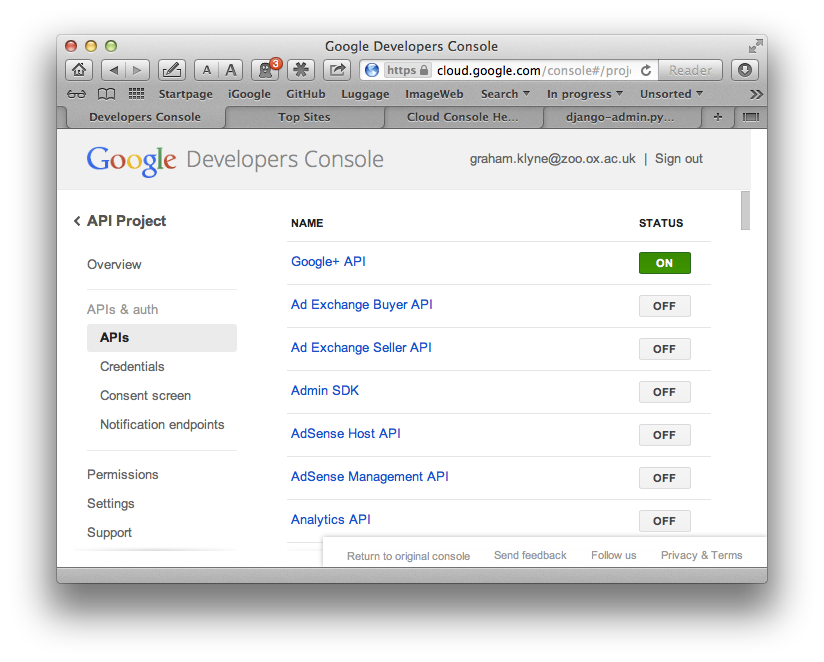

annalist
========

Free-form web data notebook - "Data management for little guys"

_Current status (2014-09-05):  feature freeze for first public prototype release.  Working on installation and setup utilities and documentation._ 

For information about the current release, please refer to the [V0.1 release notes](documents/release-notes/release-v0.1.md)

Installation
------------

See [Installing and setting up Annalist](documents/installing-annalist.md).

Goals
-----

A _Linked Data Notebook_, supporting collection, organization and sharing of structured and semi-structured data.  The name "annalist" derives from ["a person who writes annals"](http://www.oxforddictionaries.com/definition/english/annalist).

* Easy data: out-of-box data acquisition, modification and organization of small data records.
* Flexible data: new record types and fields can be added as-required.
* Sharable data: use textual, easy to read file formats that can be shared by web, email, file transfer, version management system, memory stick, etc.
* Remixable data: records that can be first class participants in a wider ecosystem of linked data, with links in and links out.

In Annalist, I hope to create a generic data notebook which can be used for diverse purposes, in which I have been motivated by the needs of small academic research groups, and my own past experiences running a small business.  I want to deliver a self-hostable, web-based tool that will, "out-of-box", allow collection of web accessible, linked data without prior design of its structure.  I aim to allow structure in data to be developed as needs arise.  Some of my ideas for this are drawn from pre-web PC tools (e.g. [WordPerfect Notebook](https://raw.github.com/gklyne/annalist/master/presentations/wpnotebook_screenshots.png) and [Blackwell Idealist](https://raw.github.com/gklyne/annalist/master/presentations/matrix.png)) which used simple text based file formats to drive flexible, small-scale databases.  I find these products occupied a sweet spot that hasn't since been matched by any web-based software of which I'm aware.

The work on Annalist is in its early stages, but I'm committed to open development from the outset, so you can see all the technical work and notes to date [here](https://github.com/gklyne/annalist).   As of August 2014, the basic data entry, form generation and configuration logic is working and it is possible to create simple collections of data.  The biggest area of missing functionality is support for a range of different data types in a data record (e.g. numbers, dates, images, links to spreadsheet data), and proper support for linking in and out (though these are possible using URIs in simple text fields).  It should be possible for a technically competent person to install and run the software, and get an indication of the direction I'm going.

Note that all the active development takes place on the ["develop" branch](https://github.com/gklyne/annalist/tree/develop).  Tested versions are periodically merged to the default-visible 'master' branch.  In due course, I plan to follow a ["gitflow"-inspired](http://nvie.com/posts/a-successful-git-branching-model/) working style that uses the "master" branch for released, tested software.

Technical elements
------------------

Note: active development is taking place on the "develop" branch in git - see [https://github.com/gklyne/annalist/tree/develop](https://github.com/gklyne/annalist/tree/develop))

Key technical elements of the intended final design include (with notes reflecting status as of March 2014):

* Serve and access data through a standard web server (current implementation uses direct file access).
* Access control with 3rd party IDP authentication (current implementation uses OAuth2/OpenID Connect, tested with Google)
* File based, versioning-friendly, textual data storage model
    * File format RDF-based (currently using JSON-LD; contexts not yet defined so it's just JSON with RDF potential)
    * Records/Entities, Attachments (blobs), Collections, Groups (current focus on collections and records/entities - more to come later)
    * Directory based organization
    * Separate indexing as and when required
* User interface
    * Self-maintained configuration data (many technical elements in place, but still bootstrapping the initial system)
    * Grid-based flexible layout engine (currently using Zurb Foundation)
* Bridges for other data sources
    * Spreadsheet (this is a key goal, to be able to work with existing spreadsheet data)
    * XML?
    * _others_?

TODO
----

See: [https://github.com/gklyne/annalist/blob/develop/documents/TODO.txt]() and [github issues](https://github.com/gklyne/annalist/issues).

Development installation with Google identity provider
------------------------------------------------------

The following instructions are a potted version of the steps I use to get a development copy of Annalist running.  The project and instructions are ongoing work-in-progress, so they may break.

    # Clone git repository
    cd _workspase_base_
    git clone https://github.com/gklyne/annalist.git
    cd annalist
    git checkout develop

    # Create Python virtualenv for testing Annalist
    virtualenv -p python2.7 anenv
    source anenv/bin/activate
    pip install -r src/annalist_root/requirements/devel.txt 
    cd src/annalist_root/

    # Run tests
    python manage.py test

    # Create development site data and run up server

    # To use Google as OAuth2/OpenID Connect provider, register the application as 
    # described in the next section, then:
    # - Copy project file `src/annalist_root/oauth2/google_oauth2_client_secrets.json.example`
    #   to `~/.annalist/providers/google_oauth2_client_secrets.json`
    # - edit `~/.annalist/providers/google_oauth2_client_secrets.json` to include the
    #   application identifier and client secret allocated when the application was
    #   registered

    # Initialize the web application data:
    #
    # There is a script file `makedevelsitedata.sh` that uses the test suite to generate some
    # initial annalist data structures, and copies this indo the `devel` directory in the
    # Annalist development tree.  This incorporates files from `annalist/sitedata` that define
    # some key information used to drive the annalist interface.
    #
    # (In due course, and installation script will need to set up the initial analist data
    # in a directory of the user's choosing.  This has not yet been implemented.)
    #
    ./makedevelsitedata.sh

    # Start the web application, using the default `devel` settings, which use the `devel` directory
    # in the Annalist source tree for the annalist site data
    python manage.py runserver

Now point a local browser at [http://localhost:8000/annalist](http://localhost:8000/annalist).  Clicking on the login link should display a login screen with "Google" offered as a login service.  Enter a user ID and click "Login" to invoke an OAuth2 authentication sequence with Google.

(Note: if using the "NoScript" browser plugin, this will trigger an XSS warning, and separately an ABE warning.  Hopefully, NoScript will fix this.  Meanwhile I added accounts.google.com as an exception from XSS sanitization, and disabled ABE checking, in NoScript.)

Google profile access
---------------------

Annalist uses OAuth2/OpenID Connect authentication to control access to data resources.  This is currently tested with Google's OAuth2 services.  For this to work, the client application must be registered with Google (via [https://cloud.google.com/console](https://cloud.google.com/console)) and must be permitted to use the [Google+ API](https://developers.google.com/+/api/), as shown:

* Create new project
* Under `APIs & Auth > APIs`, enable Google+ and disable all others
* Under `APIs & Auth > Credentials`, Create new Client Id:
  * Select "Web application"
  * Authorized redirect URI is `http://localhost:8000/annalist/login_done/` (don't omit the trailing "/").
  * Add an additional authorized redirect URIs using an actual host name if the application is to be accessible from other hosts; e.g. `http://example.org:8000/annalist/login_done/`.  Additional redirect URIs need to be included also in the local configiration file (see below).
  * No authorized Javascript origins (yet)
  * Then click button "Create client ID"
* Under `APIs & Auth > Consent screen`, fill in a name for the application
* The window now displays client id and client secret values.  The button "Download JSON" can be used to download a file that can be used to populate the file `~/.annalist/providers/google_oauth2_client_secrets.json`, but note that Annalist also uses additional field(s) not populated by the Google console.

        mkdir -p ~/.annalist/providers
        cp src/annalist_root/oauth2/google_oauth2_client_secrets.json.example ~/.annalist/providers/
        mv ~/.annalist/providers/google_oauth2_client_secrets.json.example ~/.annalist/providers/google_oauth2_client_secrets.json
        # Now edit the file to include client id and secret values provided by Google

