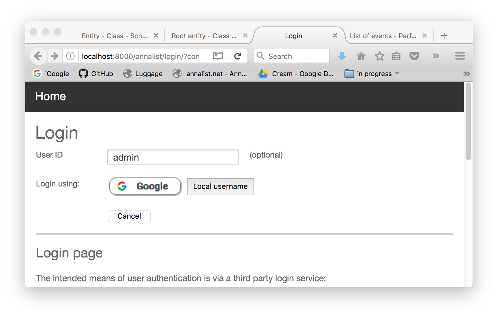
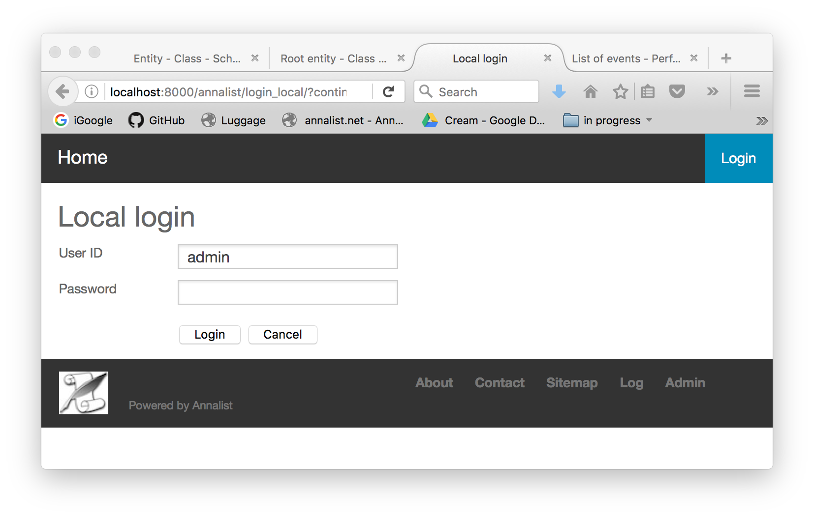

# Installing and setting up Annalist

## Contents

1. [Contents](#contents)
2. [Prerequisites](#prerequisites)
3. [New software installation](#new-software-installation)
    - [Under Python 2.7](#under-python-27)
    - [Under Python 3](#under-python-3)
4. [Upgrading an existing installation](#upgrading-an-existing-installation)
5. [Run annalist as a background process](#run-annalist-as-a-background-process)
6. [Accessing Annalist over HTTPS](#accessing-annalist-over-https)
7. [Running as a Docker container](#running-as-a-docker-container)
8. [Setting up an Annalist site](#setting-up-an-annalist-site)
    - [Annalist site options](#annalist-site-options)
    - [Annalist authentication options](#annalist-authentication-options)
        - [OpenID Connect using Google+](#openid-connect-using-google-)
        - [Local user database](#local-user-database)
    - [Initial site setup](#initial-site-setup)
9. [Accessing Annalist](#accessing-annalist)
10. [Create a collection](#create-a-collection)
11. [`annalist-manager` commands](#-annalist-manager--commands)

## Prerequisites

* A Unix-like operating system: Annalist has been tested with MacOS 10.11 and Linux 14.04.  Other versions should be usable.  (The software did once run on Windows, but the procedure to get it running is somewhat more complicated, and is not fully tested or documented.)
* Python 2.7 (see [Python beginners guide / download](https://wiki.python.org/moin/BeginnersGuide/Download)).
    - Annalist can also run under Python 3, but two of the dependencies (Django 1.11 and rdflib-jsonld 0.4.0) are not yet fully compatible, and may need to be patched.
* Under Python 2: virtualenv (includes setuptools and pip; see [virtualenv introduction](http://virtualenv.readthedocs.org/en/latest/virtualenv.html)).

NOTE: As of version 0.5.11, see discussion below about [use of HTTP and HTTPS](#accessing-annalist-over-https).
TL;DR: to test using HTTP, set environment variable OAUTHLIB_INSECURE_TRANSPORT=1

NOTE: Due to some changes with TLS and PyPI, you may see messages like these when trying to install the software when using `Python setup.py install`:

    Download error on https://pypi.org/simple/****/: [SSL: CERTIFICATE_VERIFY_FAILED] certificate verify failed: unable to get local issuer certificate (_ssl.c:1045) -- Some packages may not be found!
    Couldn't find index page for '****' (maybe misspelled?)
    Scanning index of all packages (this may take a while)
    Reading https://pypi.org/simple/
    Download error on https://pypi.org/simple/: [SSL: CERTIFICATE_VERIFY_FAILED] certificate verify failed: unable to get local issuer certificate (_ssl.c:1045) -- Some packages may not be found!
    No local packages or working download links found for ****==2.6.11
    error: Could not find suitable distribution for Requirement.parse('****==2.6.11')

If this happens, try first running:

    pip install certifi

NOTE: you may also need to ensure you are running a recent version of `pip`. At the time of writing, the current version is 18.0.

## New software installation

### Under Python 2.7

The following assumes that software is installed under a directory called $WORKSPACE; i.e. Annalist software is installed to $WORKSPACE/annalist.  This could be a user home directory.

1.  Check the version of python installed on your system.  An easy way is to just enter the `python` to see a displaty like this:

        $ python
        Python 2.7.15 (v2.7.15:ca079a3ea3, Apr 29 2018, 20:59:26)
        [GCC 4.2.1 Compatible Apple LLVM 6.0 (clang-600.0.57)] on darwin
        Type "help", "copyright", "credits" or "license" for more information.
        >>>

    If the default version shown by this command is not 2.7.x, it may still be possible to run a 2.7 version with a command like:

        $ python2.7
        Python 2.7.15 (v2.7.15:ca079a3ea3, Apr 29 2018, 20:59:26)
        [GCC 4.2.1 Compatible Apple LLVM 6.0 (clang-600.0.57)] on darwin
        Type "help", "copyright", "credits" or "license" for more information.
        >>>

    (On Linux/Unix systems, typing `python<tab>` may help to show what versions are installed.)

    In this case, you will need to use the `-p` option when running `virtualenv` to create a python environment for Annalist (see below).

2.  Go to the workspace directory, create a Python virtual environment and activate it (i.e. make it the current Python environment).  This avoids having the Annalist installation stomp over any other Python installation, and makes it very easy to discard if or when it is not required.

        cd $WORKSPACE
        virtualenv annenv
        source annenv/bin/activate

    In an environment where the are multiple versions of Python installed, a `virtualenv` command like this might be needed to ensure that the appropriate version of Python is used:

        virtualenv -p python2.7 annenv
        source annenv/bin/activate

3.  Install the software from PyPI:

        pip install annalist

4.  Alternatively, obtain a copy of the Annalist distribution kit, e.g. from [annalist.net](http://annalist.net/), and copy to a conventient location (e.g., $WORKSPACE/Annalist-0.5.10.tar.gz).  Then install it thus:

        pip install $WORKSPACE/Annalist-0.5.10.tar.gz

5.  Finally, test the installed software:

        annalist-manager runtests

    The output from this command should look something like this:

        $ annalist-manager runtest
        INFO:annalist_site.settings.runtests:Annalist version 0.5.11 (test configuration)
        INFO:annalist_site.settings.runtests:SETTINGS_MODULE: annalist_site.settings.runtests
        INFO:annalist_site.settings.runtests:BASE_DATA_DIR:   /Users/graham/workspace/github/gklyne/annalist/anenv3/lib/python3.7/site-packages/Annalist-0.5.11-py3.7.egg/annalist_root/sampledata/data
        INFO:annalist_site.settings.runtests:CONFIG_BASE:     /Users/graham/.annalist/
        INFO:annalist_site.settings.runtests:DJANGO_ROOT:     /Users/graham/workspace/github/gklyne/annalist/anenv3/lib/python3.7/site-packages/Django-1.11.13-py3.7.egg/django
        INFO:annalist_site.settings.runtests:SITE_CONFIG_DIR: /Users/graham/workspace/github/gklyne/annalist/anenv3/lib/python3.7/site-packages/Annalist-0.5.11-py3.7.egg/annalist_root/annalist_site
        INFO:annalist_site.settings.runtests:SITE_SRC_ROOT:   /Users/graham/workspace/github/gklyne/annalist/anenv3/lib/python3.7/site-packages/Annalist-0.5.11-py3.7.egg/annalist_root
        INFO:annalist_site.settings.runtests:TEST_BASE_URI:   http://test.example.com/testsite
        INFO:annalist_site.settings.runtests:DEFAULT_DB_PATH: /Users/graham/workspace/github/gklyne/annalist/anenv3/lib/python3.7/site-packages/Annalist-0.5.11-py3.7.egg/annalist_root/sampledata/data/annalist_site/db.sqlite3
        INFO:annalist_site.settings.runtests:DATABASE_PATH:   /Users/graham/workspace/github/gklyne/annalist/anenv3/lib/python3.7/site-packages/Annalist-0.5.11-py3.7.egg/annalist_root/sampledata/data/annalist_site/db.sqlite3
        INFO:annalist_site.settings.runtests:STATICFILES_DIRS: ('/Users/graham/workspace/github/gklyne/annalist/anenv3/lib/python3.7/site-packages/Annalist-0.5.11-py3.7.egg/annalist_root/annalist/data/static/', '/Users/graham/workspace/github/gklyne/annalist/anenv3/lib/python3.7/site-packages/Annalist-0.5.11-py3.7.egg/annalist_root/annalist/data/identity_providers/')
        INFO:annalist_site.settings.runtests:LOGGING_FILE:     /Users/graham/workspace/github/gklyne/annalist/anenv3/lib/python3.7/site-packages/Annalist-0.5.11-py3.7.egg/annalist_root/annalist.log
        Creating test database for alias 'default'...
        System check identified no issues (0 silenced).
        .......................................................................................................................................................................................................................................................................................................................................................................................................................................................................................................................................................................................................................................................................................................................................................................................................................................
        ----------------------------------------------------------------------
        Ran 807 tests in 248.154s

        OK
        Destroying test database for alias 'default'...

### Under Python 3

Use Python version 3.6, as Django 1.11 (the last version to support Python 2) is not supported under later versions.  (I have found one syntax error reported running Django under Python 3.7: fix that and all is well.)

Python3 includes a `virtualenv` equivalent called `venv`.  To create a virtual environment for running Annalist, go to the desired home directory and run:

    python3 -m venv anenv3
    source anenv3/bin/activate
    pip install --upgrade pip
    pip install certifi

From here on, the Annalist installation is the same as under Python 2, starting from step 3 (above).

## Upgrading an existing installation

Stop any existing annalist server.  Look for background processes running `annalist-manager` or `django-admin`.  There may be up to three separate background processes that need to be stopped.

NOTE: irreversible changes are applied to site and collection data when upgrading, particularly from versions below 0.5.0.  It is recommended to make a duplicate copy of the ananlist site data before upgrading the software,  This will make it possible to revert to an earlier verson in the event of problems with the newer software. For example, to back up a default "personal" configuration on Linux:

    cp -ax ~/annalist_site ~/annalist_site.backup

The installation instructions above ("New software installation") can then be used to update an Annalist software installation, except that step 2 may be skipped if re-using an existing virtual environment.

The annalist user database may need to be initialized or migrated:

    annalist-manager initialize [ CONFIG ]

If upgrading from a version 0.1.4 or earlier, recreate an admin user:

    annalist-manager defaultadminuser [ CONFIG ]

To update site-wide data for an existing Annalist site, use:

    annalist-manager updatesitedata [ CONFIG ]

If any of the Annalist installable collection data is used then these should be re-installed (assuming they have not been modified locally since they were installed); e.g.

    annalist-manager installcollection Resource_defs -f [CONFIG]
    annalist-manager installcollection Concept_defs -f [CONFIG]
    annalist-manager installcollection Journal_defs -f [CONFIG]

(The `-f` or `--force` option allows the existing collection to be replaced by new defnitions provided by the new Annalist release.)

Existing user collection data will be migrated as it is accessed, but it may be cleaner to migrate all data _en masse_ before startign to access it, thus:

    annalist-manager migrateallcollections [ CONFIG ]

Then start the server as before.

e.g.

    annalist-manager initialize --personal
    annalist-manager defaultadminuser --personal
      Creating user admin
      Password:
      Re-enter password:
    annalist-manager updatesitedata --personal
    annalist-manager installcollection Resource_defs -f --personal
    annalist-manager migrateallcollections --personal
    annalist-manager runserver --personal

## Run annalist as a background process

To run annalist as a long-running background process, use the following command:

    nohup annalist-manager runserver &

(with `annalist-manager` configuration options if required.)

To view the server log of a running Annalist instance:

    less $(annalist-manager serverlog)

To check for Annalist background processes, and to terminate an Annalist server running as a background process (run from the same user account that started annalist):

    ps x
    killall python

## Accessing Annalist over HTTPS

As of version 0.5.11, Annalist should be accessed over HTTPS rather than HTTP.  The in-built HTTP server does not support HTTPS, so this is achieved by using a standard web server (e.g. Apache httpd or Nginx) to accept incoming HTTPS requests and pass them on to Annalist using local HTTP (using a configuration called "reverse proxying").

(@@TODO: write up details for setting up Apache and/or Nginx reverse-proxy)

This particularly affects the OpenID Connect login, which now fails if an HTTPS connection is not being used (as using HTTP could result in exposure of credentials.  To test the software using the in-build development server (i.e. using HTTP rarher than HTTPS), use the following command (in a BASH shell):

    OAUTHLIB_INSECURE_TRANSPORT=1 python manage.py runserver 0.0.0.0:8000

or

    OAUTHLIB_INSECURE_TRANSPORT=1 annalist-manager runserver

Or otherwise set the environment variable OAUTHLIB_INSECURE_TRANSPORT when running the server.

## Running as a Docker container

Prerequisite for this option:  a Linux operating system with [Docker](https://www.docker.com) installed.

If Annalist Docker containers have been used previously on the host system, the following commamnds ensure you have the latest images:

    docker pull gklyne/annalist_site
    docker pull gklyne/annalist

If this is the first time Annalist has been run on this system, create a new Annalist site data container:

    docker run --name=annalist_site --detach gklyne/annalist_site
    
Then

    docker run --interactive --tty --rm \
        --publish=8000:8000 --volumes-from=annalist_site \
        gklyne/annalist bash

The remaining commands are executed in the shell environment presented by the `docker run` command above.

    annalist-manager version

Check the version displayed: I've found Docker sometimes caches older versions and fails up update to the latest available.  If necessary, use `docker rmi gklyne/annalist` to remove old images from the local cache.  If all is well, continue as follows:

If this is the first time Annalist has been run on this system, create a new Annalist site data and database:

    annalist-manager createsitedata
    annalist-manager initialize

or, to keep previous annalist collection data:

    annalist-manager updatesitedata

NOTE: for configurations which store the database file in the site data area (including the default personal configuration used here), `annalist-manager createsitedata` must be run before `annalist-manager initialize`, as it requires absence of any previous site data or database files.
When updating an Annalist site, it should not be necessary to run `annalist-manager initialize`.

Then, to start the Annalist web server:

    annalist-manager runserver

At this point, a browser can be directed to port 8000 (e.g. http://localhost:8000) of the Docker container host to interact with the Annlist system and data.

Existing Analist collection data can be loaded into a new installation, before strarting the server.  For example, an experimental Digital Music Object, which demonstrates several features of Annalist, can be loaded thus:

    cd /annalist_site/annalist_site/c/
    git clone https://github.com/gklyne/DMO_Experiment.git

To run Annalist server as a headless container (no shell):

    docker run --detach \
        --publish=8000:8000 --volumes-from=annalist_site \
        gklyne/annalist \
        annalist-manager runserver

From version 0.1.11 onwards, the server logs are located on the annalist_site data volume, and may be viewed by running a second Docker container, thus:

    docker run --interactive --tty --rm \
        --volumes-from=annalist_site \
        gklyne/annalist bash

then

    less $(annalist-manager serverlog)

## Setting up an Annalist site

Before setting up an Annalist configuration, there are two issues to be aware of.  Or if you just want a quick installation for evaluation purposes, skip ahead to "Initial site setup".

### Annalist site options

Annalist deployment details are controlled by files in the `src/annalist_root/annalist_site/settings` directory.  Annalist comes with three pre-defined configurations: deveopment, personal, and shared.  The main differences between these are the location of the Annalist site data files, and the location of certain private configuration files.  (Other configuration options are possible by defining a new settings file.)

**Development**: Annalist site data is kept in a directory within the Annalist software source tree, and configuration files are in subdirectory `.annalist` of the installing user's home directory.

**Personal**: Annalist site data is in a subdirectory `annalist_site`, and configuration files are in subdirectory `.annalist`, of the installing user's home directory.

**Shared**: Annalist site data is kept in directory `/var/annalist_site`, and configuration files are in subdirectory `/etc/annalist`.  Such an installation will typically require root privileges on the host computer system to complete.

For most purposes, the default (**Personal**) configuration works just fine.  For shared instances, I use this with a dedicated user (e.g. `annalist`).

### Annalist authentication options

Annalist has been implemented to use federated authentication based on Open ID Connect (http://openid.net/connect/) rather than relying on local user credential management.  Using third party authentication services should facilitate integration with single-sign-on (SSO) services, and avoids the security risks assciated with local password storage.  Unfortunately, installing and configuring a system to use an OpenID Connect authentication service does take some addtional effort to register the installed application with the authentication service.

Annalist currently supports two user authentication mechanisms: OpenID Connect using Google+, and local user login credentials.  (Other OpenID Connect providers may also work, but have not been tested.)

#### OpenID Connect using Google+

Annalist OpenID Connect authentication has been tested with Google+ identity service.  Instructions for configuring a new installation to work with Google+ are in [Configuring Annalist to use OpenID Connect](openid-connect-setup.md).

The configuration details for using an OpenID Connect provider are stored in a private area, away from the Annalist source files and site data, since they contain private keying data.  A subdirectory `providers` of the Annalist configuration directory contains a description file for each supported OpenID Connect provider.  New providers may be supported by adding descrtiption files to this directory.  The provider description for Google may be a useful example for creating descriptions for other providers.  (But be aware that different providers will have different registration procedures, and may require subtlely different forms of configuration information.)

#### Local user database

Annalist can also allow users to log in using locally stored credentials, which may be useful for quick evaluation deployments but is not the recommended mechanism for normal operational use.

When installing Annalist, an administration account may be created using the `annalist-manager` tool.  When logged in to Annalist using this account, the **Admin** link in the footer of most Annalist pages will allow new user accounts to be created via the Django admin interface.  More documentation about using this admin interface is in the [The Django Admin Site](http://www.djangobook.com/en/2.0/chapter06.html), which is Chapter 6 of [The Django Book](http://www.djangobook.com/en/2.0/index.html).

### Initial site setup

These instructions use the example of a local user database: these options are not suitable for a full deployment, but are probably the least intrusive to use for early evaluation purposes.  Alternatively, for a quickstart, use the Docker container described above.

NOTE: using the development configuration, data files are stored within the software source code tree, and will be removed when the software is updated.  Use a personal configuration if you want to preserve any data files you create.

1.  The commands must be issued with the annalist python environment activated.  If needed, use a command like this (where "annenv" is replaced with the name used previously to create the python virtual environment):

        source annenv/bin/activate

2.  Initialize sitedata:

        annalist-manager createsitedata

     (Don't do this if updating annalist software to use existing site data: use `annalist-manager updatesitedata` instead)

3.  Initialize user management database

        annalist-manager initialize

4.  Create admin user

        annalist-manager createadminuser

    Respond to the prompts with a username, email address and password.  The username may be up to 30 characters, and may consist of letters, digits and underscores.

    Alternatively, to create a default admin user with name `admin` and email address `admin@localhost`, use this command:

        annalist-manager defaultadminuser

    As before, enter and re-enter a password when prompted.

5.  Start the Annalist server

        annalist-manager runserver

You should now be able to use a browser to view the Annalist server, e.g. at http://localhost:8000.

NOTE: for configurations which store the database file in the site data area (including the default personal configuration), `annalist-manager createsitedata` must be run before `annalist-manager initialize`, as it requires absence of any previous site data or database files.  When updating an existing Annalist site, it should not be necessary to run `annalist-manager initialize`.

## Accessing Annalist

The following instructions assume a browser running on the same host as the Annalist service.  If a different host is used, replace `localhost` with the name or IP address of the host that is running the Annalist server.

1.  Browse to annalist server at http://localhost:8000 (replacing `localhost` as needed)

    An empty list of collections should be displayed, along with some help text:

    

2.  Select the **Login** item from the top menu bar:

    

3.  Enter the local adminsirator id (e.g. `admin`) in the **User IOd** field, then click on the 
**Local username** button:

    

4.  Enter the admin user credentials specified previously when creating the Annalist admin user, and click the 'Login' button:

    

5.  Click the **Home** link on the top menu bar to return to the front page:

    

    Note that the front page now shows text entry boxes and a button for creating a new collection.

At this point, the **Admin** link in the page footer can be used to create additional local users via the local administrative interface (which is implemented in the underlying Django web application framework).  Or just continue straight to create an initial data collection.

## Create a collection

This section assumes you are logged in to an Annalist system.

To create a new _collection_, which is an Annalist unit of administrable and copyable data, enter a short name for the collection (consisting of just letters, digits and/or underscorte (`'_'`) characters) and a one-line label or description (which can contain arbitrary characters) into the text boxes presented:

Now click on the 'New' button:

Click on the link in the Id column to view the new collection:

From this screen, you can start to add data to this collection.  For more information, see [Using Annalist](using-annalist.adoc)

## `annalist-manager` commands

Use `annalist-manager help` for a command summary.

