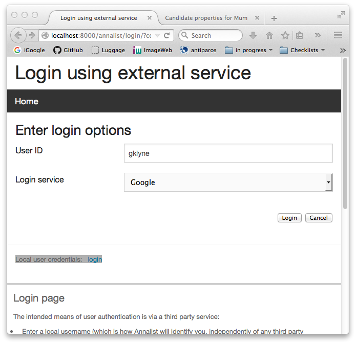
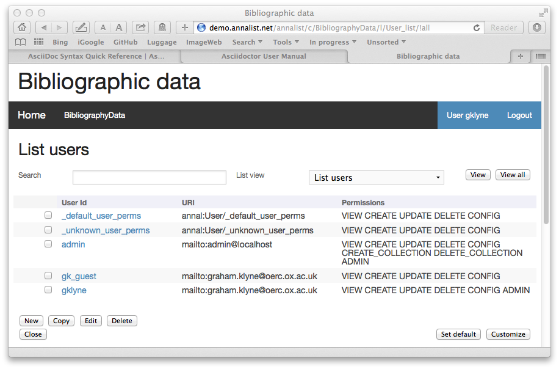
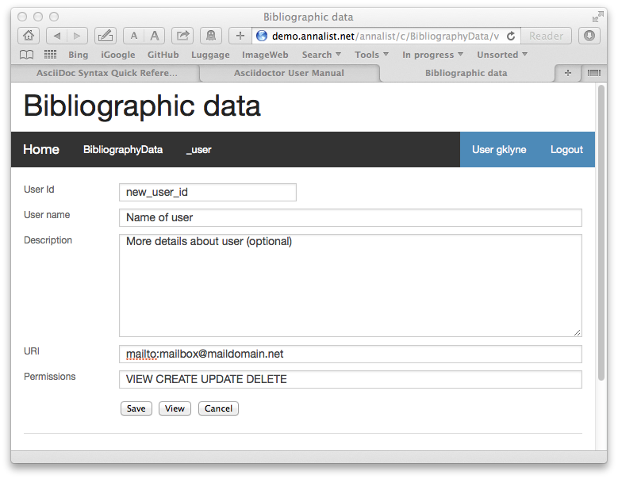

= Annalist tutorial
Graham Klyne
v0.1.20, 2015-09-25
:toc: macro
:toc-title:

This document provides a task-oriented introduction to using Annalist.  It assumes Annalist has been installed or deployed, and provides step-by-step description of how various data management tasks can be performed using Annalist.

*Table of Contents*

toc::[]

== Running example

This tutorial uses a running example of a personal photograph library, starting with a simple catalogue of images and some associated metadata, and then adding additional structures to cross reference other entitiues involved in the picture-taking process.

The final example can be seen at the http://demo.annalist.net/[Annalist demo site], as collection [Annalist photo collection].  (@TODO)

== Log in to Annalist

Browse to the Annalist site login page; e.g. http://demo.annalist.net/annalist/site/, then http://demo.annalist.net/annalist/login/.

The first time of logging in to an Annalist site from some computer will involve some or all of the following.

* select a User ID
* enter User ID into login form
* select "Google" for the Login Service
* click "Login"

At this point the browser is redirected to Google's own login page to enter account credentials, and maybe also a 2-factor authentication code.  Once the authentication credentials have been entered and verified, Google may then ask for your permission to disclose information to the Annalist application.  The information to be disclosed is described;  Annalist uses only the email address, which is used in conjucntion with the User ID entered to select a set of user permissions (see "User permissions" section).

****
@@When alternative ID provders are supported, note this
****

If the User ID has already been used by a different user, a message is displayed (@@ message text)

After the first time, use the same details and click "Login".  Typically, if this is a personal machine you have used before, the login will complete without any further interaction.

.Annalist login form

The login sequence associates an authenticated email address with the User ID given, which is used to determine appropriate access permissions (see "User permissions" below).

.Annalist logged in

Once the login is complete, click on "Home" in the menu bar to return to the main Annalist site

.Annalist home page

=== Using public computers

If you login from a public computer, remember to log out from your identity provider when you have finished using Annalist and before leaving the computer.

@@details for logout from Google.

=== Local authentication

@@Update this when "Local" is implemented as a login service

Annalist has been designed to use third party authentication.  This avoids having to deal with the tricky technical and operational difficulties of managing password files;  leaked password files are a very common form of security failure, so by leaving this to the ID provider professionals, user security should be improved.  This also allows users to log in using an existing account rather than having to allocate and remember a new password for Annalist.

Sometimes (for example when Annalist is required to be usable when not connected to the Internet), it may be preferred to use locally managed passwords.  Annalist can use the local password management and login features of the Django web application platform on which it is built.

When installing Annalist, an administration account may be created using the `annalist-manager` tool.  When logged in to Annalist using this account, the *Admin* link in the footer of most Annalist pages will allow new user accounts to be created via the Django admin interface.  More documentation about using this admin interface is in the http://www.djangobook.com/en/2.0/chapter06.html[The Django Admin Site], which is Chapter 6 of http://www.djangobook.com/en/2.0/index.html[The Django Book].

To log in using a Dango account clock on the "Local user credentials" `login` link, and enter a Django username and password into the new page that is displayed.  Once logged in, return to the Annalist site "Home" page 

== User permissions

Annalist keeps a set of user permissions associated with every combination of User ID *and* authenticated email address.

User permissions may be defined site-wide (i.e. they can apply for all collections across a site), or they may be defined separately for each collection.  Thus, different permissions may be granted to different users in different collections.  Permission to create new collections must be site-wide.

Site-wide permissions are defined using the `annlist-manager`command line administration tool, and cannot currently be defined through the web interface.  See link:installing-annalist.md[Installing and setting up Annalist] for more information about `annalist-manager`, or run the command `annalist-manager help`.

****
@@Update this when the web interface can define site-wide permissions.

@@analist-manager currently has a bare miniumum of capabilities to create users, mainly intended to bootstrap a system with admin users.
****

Within a collection, a user with `ADMIN` permissions on that collection can view the user permissions for the collection in the List view `List users`.  To view the list of user permissions for a collection, browse to that collection which will display some list of records.  In the `List view` dropdown, select option `List users`, and click `View` see see user permissions defined for the collection only, or `View all` to also list site-wide user permissions.

.List user permissions for an Annalist collection

There are two "special" users that are used to select access permissions applied to users for whom no more specific permissions are available:

`annal:User/_unknown_user_perms` defines permissions that are applied for any user who is not logged in to Annalist.  Typically, this might be used to grant public read-only access to a collection.

`annal:User/_default_user_perms` defines permissions that are applied for any user who is logged in to Annalist, but for whom no more specifiuc permissions are granted.  Permissions thus granted are effectively available to anyone who comes to the web site, but any actions they perform are potentially auditable, being associated with an authenticated (by Google) email address.

New permissions may be added from the "List user permissions" page by clicking `New`:

.Creating new user permissions for an Annalist collection

The `User Id` field corresponds to the User Id entered in the login page.

The `URI` field (usually a `mailto:` URI) corresponds to the authenticated email address provided by the identity service (e.g. by Google).  In principle, other forms of URI might be authenticated by an ID service, but this is not currently part of the OpenId Connect protocol used.

The `Permissions` field is a list of tokens (names) corresponding to permissions granted to this user.  For the permissions to apply, both the user ID used to log in and the authenticated email address must match the `User Id` and `URI` fields.

The standard Annalist permission tokens include:

`ADMIN` - required to create or view user permissions in a collection.  The creator of a collection is automatically granted `ADMIN` permissions over that collection, so they can assign permissions in that collection for other users.  This permission at site level also allows creation and deletion of collections.

`CONFIG` - required to change the structure of a collection: to create and/or modify record types, views, lists, etc.

`CREATE` - required to create new data in a collection.

`UPDATE` - required to edit data records in a collection.

`VIEW` - required to view or read data records in a collection.

`DELETE` - required to remove data records in a collection.

`CREATE_COLLECTION` - this permission, or `ADMIN`, is required at site level to create a new collection.

`DELETE_COLLECTION` - this permission, or `ADMIN`, is required at site level to remove an existing collection.

(Future developments may allow for the introduction of additional tokens on a per-collection basis, but for now these are all of the available permissions.)

== Browsing an existing Annalist collection

@@TODO

== Creating a new collection

@@TODO

== Add simple fields to a data record

@@TODO

== Upload images to a collection

@@TODO

== Add repeating fields to a data record

@@TODO

== Create an additional data type

@@TODO

== Create links to another record

@@TODO

== Display fields from a linked record

@@TODO

@@ Using `RefMultifield` render type, and task button 

== Creating simple record type hierarchies

@@TODO

@@ (e.g. subjects -> people / places / events)

== (Any more?)

@@TODO

