= Annalist tutorial
Graham Klyne
v0.5.16, 2019-10-15
:toc: macro
:toc-title:
:linkcss:
:stylesheet: annalist-tutorial-asciidoctor.css

This document provides a task-oriented introduction to using Annalist.  It assumes Annalist has been installed or deployed, and provides step-by-step description of how various data management tasks can be performed using Annalist.

NOTE: This document is an early draft, and is much in need of improvement.  Please submit feedback and comments either to the https://github.com/gklyne/annalist/issues[Annalist Github issues list], or via the https://groups.google.com/forum/#!forum/annalist-discuss[Annalist discussion group].

*Table of Contents*

toc::[]

== Running example

This tutorial uses a running example of a personal photograph library, starting with a simple catalogue of images and some associated metadata, and then adding additional structures to cross reference other entities involved in the picture-taking process.  For this example, we use a prefix `pcat` for URIs (actually http://www.w3.org/TR/curie/[Compact URIs], or CURIEs) defined specifically for the photograph catalogue.  This prefix will eventually be associated with a base URI to allow identification on the World Wide Web.  (@@TODO: full linked data support.)

The completed example can be seen at the http://demo.annalist.net/[Annalist demo site], as collection [Annalist photo collection].  (@@TODO, once current in-development software is deployed.)

== Log in to Annalist

Browse to the Annalist site login page; e.g. http://demo.annalist.net/annalist/site/, then http://demo.annalist.net/annalist/login/.

The first time of logging in to an Annalist site from some computer using Google credentials will involve the following.

* enter User ID into login form
* in the row labeled "Login using", click on "Google"

[.text-center]
.Annalist login form
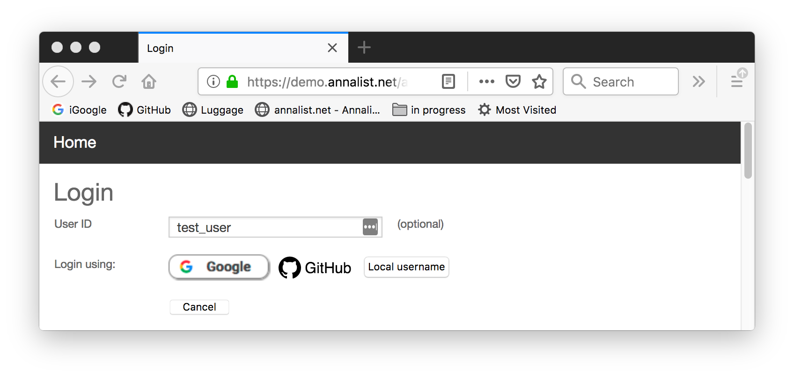

At this point the browser is redirected to Google's own login page to enter account credentials, and maybe also a 2-factor authentication code.  Once the authentication credentials have been entered and verified, Google may then ask for your permission to disclose information to the Annalist application.  The information to be disclosed is described;  Annalist uses only the email address, which is used in conjucntion with the User ID entered to select a set of user permissions (see "User permissions" section).

Completion of login displays a profile page like this: 

[.text-center]
.Annalist logged in
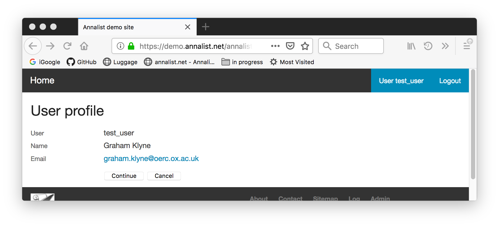

Once the login is complete, click on "Continue", or "Home" in the menu bar, to return to the main Annalist site:

[.text-center]
.Annalist home page
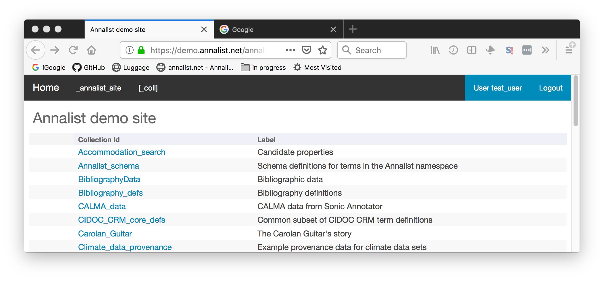

A number of other identity providers may be shown.  At the time of writing (October 2019), Annalist has been tested using Google and Github as login identity providers.  Also, usernames and passwords may be configured locally in the Django web hosting environment (see "admin" in the footer menu), and access via the "Local username" button (see "Local authentication" below).

If the User ID given has already been used by a different user (i.e. with a different email address), a message is displayed (e.g., "Login failed:  Authenticated user test_user email address mismatch (gklyne@googlemail.com, graham.klyne@oerc.ox.ac.uk)"").

After the first time of logging in, use the same User ID value, and click the appropriate "Login using" button.  Typically, if this is a personal machine you have used before, the login will complete without any further interaction.

The login sequence associates an authenticated email address with the User ID given, which is used to determine appropriate access permissions (see "User permissions" below).

=== Using public computers

If you login from a public computer, remember to log out from your identity provider when you have finished using Annalist and before leaving the computer.

****
@@details for logout from Google.
****

=== Local authentication

Annalist has been designed to use third party authentication.  This avoids having to deal with the tricky technical and operational difficulties of managing password files;  leaked password files are a very common form of security failure, so by leaving this to the ID provider professionals, user security should be improved.  This also allows users to log in using an existing account rather than having to allocate and remember a new password for Annalist.

Sometimes (for example when Annalist is required to be usable when not connected to the Internet), it may be preferred to use locally managed passwords.  Annalist can use the local password management and login features of the Django web application platform on which it is built.

When installing Annalist, an administration account may be created using the `annalist-manager` tool.  When logged in to Annalist using this account, the *Admin* link in the footer of most Annalist pages will allow new user accounts to be created via the Django admin interface.  More documentation about using this admin interface is in the http://www.djangobook.com/en/2.0/chapter06.html[The Django Admin Site], which is Chapter 6 of http://www.djangobook.com/en/2.0/index.html[The Django Book].

To log in using a Dango account, select "Local username" on the login form, and enter a Django username and password into the new page that is displayed.  Once logged in, return to the Annalist site "Home" page .

[.text-center]
.Annalist local login form
image::screenshot-login-django.png[Annalist local login form,width=500,align=center]

== User permissions

Annalist keeps a set of user permissions associated with every combination of User ID *and* authenticated email address.

User permissions may be defined site-wide (i.e. they can apply for all collections across a site), or they may be defined separately for each collection.  Thus, different permissions may be granted to different users in different collections.  Permission to create new collections must be site-wide.

Within a collection, a user with `ADMIN` permissions on that collection can view and edit the user permissions for the collection.  To view the list of user permissions for a collection, browse to that collection, then select the "Customize" button at the bottom of the displayed page.  On the next page, select the `User permissions` link to see user permissions defined for the collection only.  To see all permissions, including site-wide permissions, that apply to the collection, select the `Scope all` checkbox, and click on the "List" button.

[.text-center]
.List user permissions for an Annalist collection
image::screenshot-annalist-permissions.png[Annalist collection user permissions,width=500,align=center]

=== Special Annalist user identifiers

There are two "special" users that are used to select access permissions applied to users for whom no more specific permissions are available:

`annal:User/_unknown_user_perms` defines permissions that are applied for any user who is not logged in to Annalist.  Typically, this might be used to grant public read-only access to a collection.

`annal:User/_default_user_perms` defines permissions that are applied for any user who is logged in to Annalist, but for whom no more specifiuc permissions are granted.  Permissions thus granted are effectively available to anyone who comes to the web site, but any actions they perform are potentially auditable, being associated with an authenticated (by Google) email address.

=== Adding user access permissions to a collection

New permissions may be added from the "List user permissions" page (see above) by clicking `New`:

[.text-center]
.Creating new user permissions for an Annalist collection
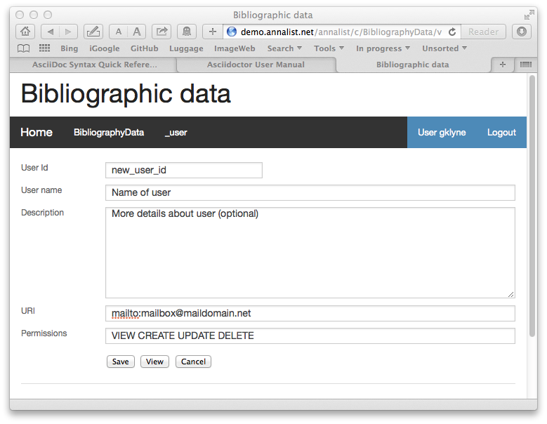

The `User Id` field corresponds to the User Id entered in the login page.

The `URI` field (usually a `mailto:` URI) corresponds to the authenticated email address provided by the identity service (e.g. by Google).  In principle, other forms of URI might be authenticated by an ID service, but these are not currently part of the http://openid.net/connect/[OpenId Connect protocol] used.

The `Permissions` field is a list of tokens (names) corresponding to permissions granted to this user.  For the permissions to apply, both the user ID used to log in and the authenticated email address must match the `User Id` and `URI` fields.

=== Adding site-wide user access permissions

Site-wide permissions are initially defined using the `annalist-manager` command line administration tool. See link:../installing-annalist.md[Installing and setting up Annalist] for more information about `annalist-manager`, or run the command `annalist-manager help`.  (`annalist-manager` currently has a bare miniumum of capabilities to create users, mainly intended to bootstrap a system with administrative access.)

Once basic administrative access has been established, additional site-wide permissions can be created by creating or editing user permissions in the `_annalist_site` collection.  Site-wide administrative access is requiured to edit the `_annalist_site` collection, but the process is otherwise the same as adding permissions to a specific collection.

=== Annalist permission tokens

The standard Annalist permission tokens include:

`ADMIN` - required to create or view user permissions in a collection.  The creator of a collection is automatically granted `ADMIN` permissions over that collection, so they can assign permissions in that collection for other users.  This permission at site level also allows creation and deletion of collections.

`CONFIG` - required to change the structure of a collection: to create and/or modify entity types, views, lists, etc.

`CREATE` - required to create new data in a collection.

`UPDATE` - required to edit data records in a collection.

`VIEW` - required to view or read data records in a collection.

`DELETE` - required to remove data records in a collection.

`CREATE_COLLECTION` - this permission, or `ADMIN`, is required at site level to create a new collection.

`DELETE_COLLECTION` - this permission, or `ADMIN`, is required at site level to remove an existing collection.

(Future developments may allow for the introduction of additional tokens on a per-collection basis, but for now these are all of the available permissions.)

== Browsing an existing Annalist collection

****
@@TODO

@@Top bar (Home, collection, type)

@@Bottom bar (About, Contact, Sitemap, Admin)

@@Other common controls:  Choose view; List view / view all; Customize; Set default
****

== Creating a new collection

Creating a new collection requires site-level permission `CREATE_COLLECTION` or `ADMIN`.

To create a new collection, go to the Annalist site home page and enter a collection id and description for the new collection, and click the `New` button.  The collection id must consist of letters, digits and underscore ('_') characters only, and be no longer than 32 characters.

[.text-center]
.Creating new Annalist collection
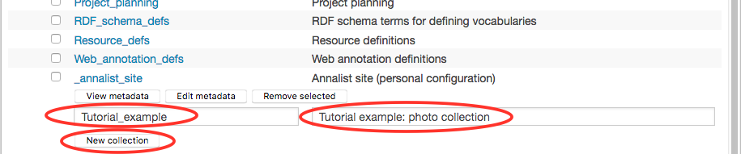

In the updated list of collections, click on the link corresponding to the new collection to view its initial content:

[.text-center]
.View new Annalist collection
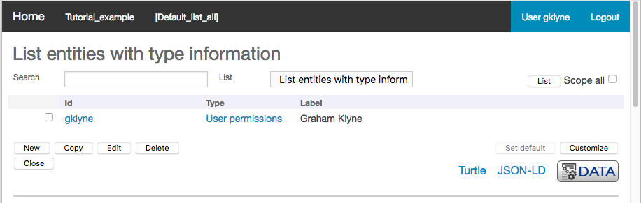

== Change collection metadata

Modifying collection metadata requires `CONFIG` permissions.

A collection name, label, description and other metadata may be edited by viewing the site home page, selecting the checkbox by the collection to be edited, then clicking on the "Edit metadata" button:

[.text-center]
.Edit Annalist collection metadata
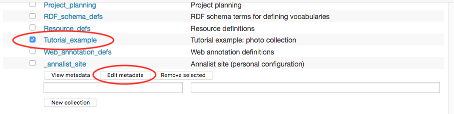

Alternatively, view the collection by clicking its link, then click the "Customize" button, and on the next page click the "Collection metadata" button:

[.text-center]
.Edit Annalist collection metadata via Customize page
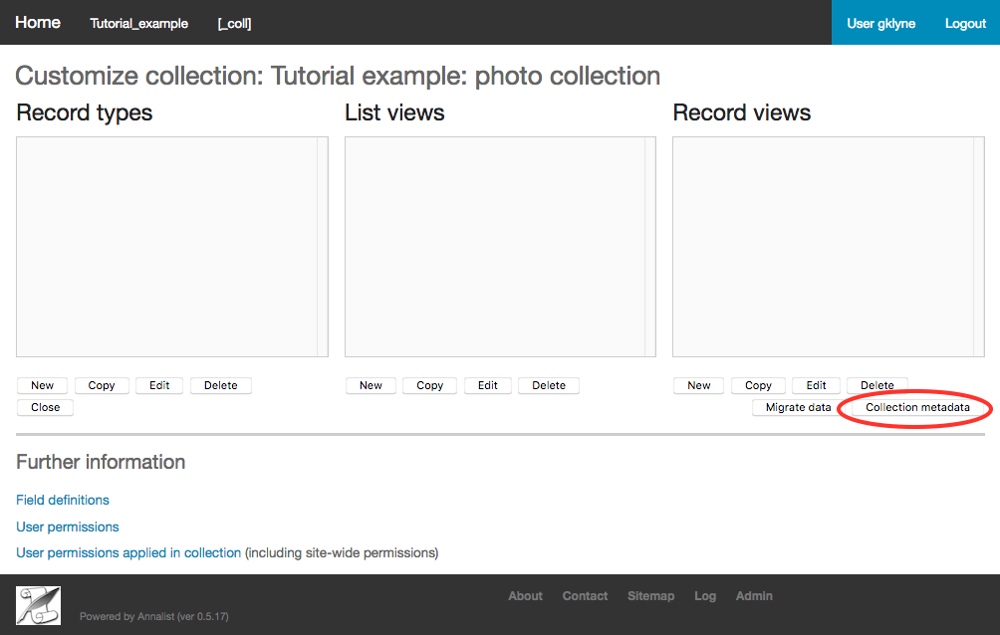

Either way, a form for editing the collection metadata is presented:

[.text-center]
.Annalist collection metadata edit view
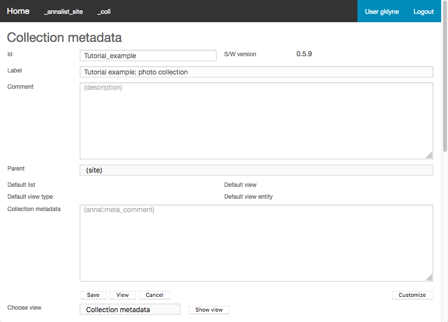

By default, a collection inherits site-wide type, view and field definitions that are defined by the Annalist software.  It may also inherit definitions from another existing collection on the same site by selecting that collection in the `Parent` field.  This feature is intended to allow a collection to be based on an existing set of definitions rather than starting every time from scratch.

== Create initial entity type and views

It is possible to start creating new data entitys straight away in a newly created collection, using the in-built `Default_type` and associated views.  But for practical use, it is probably better to start by creating a new entity type and corresponding views to match the initial data to be collected.

Creating entity types and views for a collection requires permission `CONFIG` in that collection.  The user who creates a collection is automatically granted full permissions for that collection.  They may, in turn, create permissions for other users.

View the entity types by viewing the collection, and clicking the "Customize" button:

[.text-center]
.Select `Customize` option
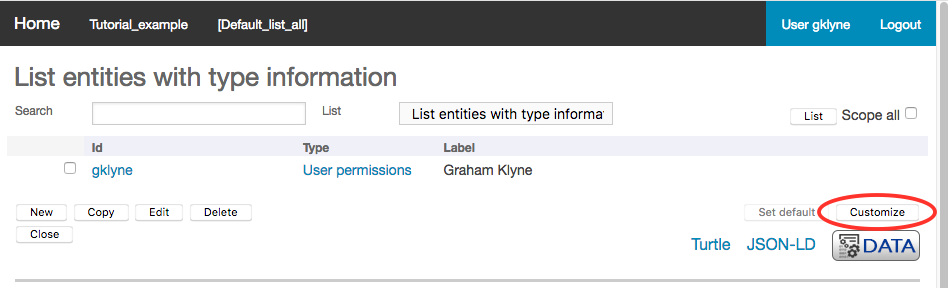

Click the `New` button under `Entity types` to create a new entity type:

[.text-center]
.List entity types in Annalist collection
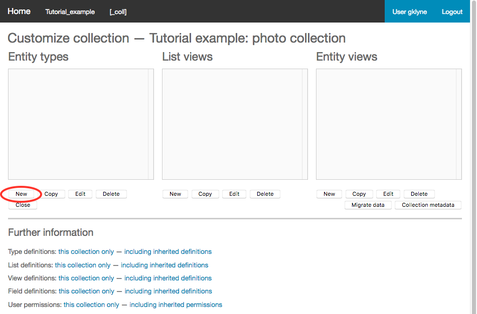

Enter some details about this entity type (e.g. as shown below).  To define an initial tailorable view and list descriptions for the new entity type, click on the `Define view+list` button.  The `Default view` and `Default list` fields are updated accordingly: 

[.text-center]
.Creating new entity type, view and list in Annalist collection
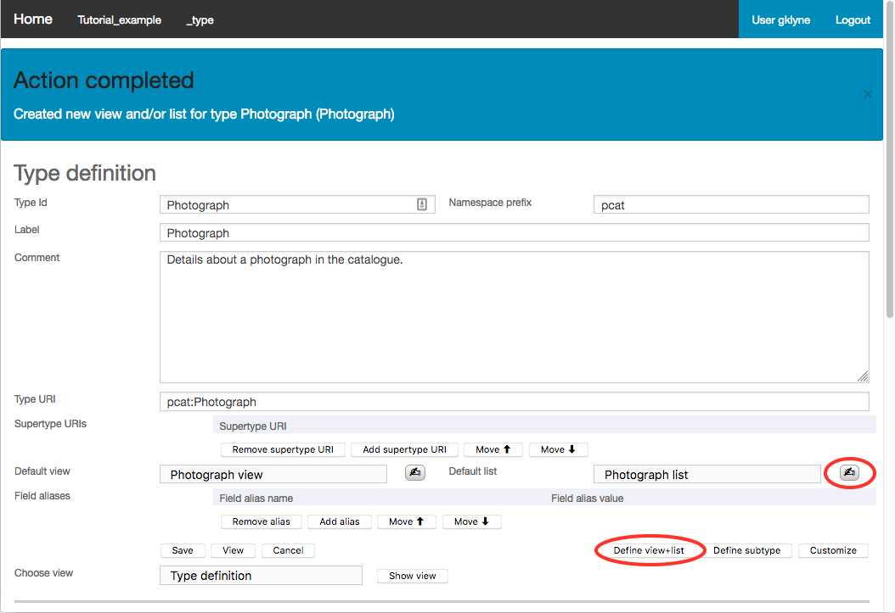

Details of the generated list and/or view descriptions can be edited by clicking on the nearby image:button-edit-entity.png[] button, and making changes as desired.  Click `Save` when done to return to the type description page.  The label, "Photograph list" has been automatically generated;  we might wish to change this to just "Photographs":

[.text-center]
.Edit definition for list of photographs
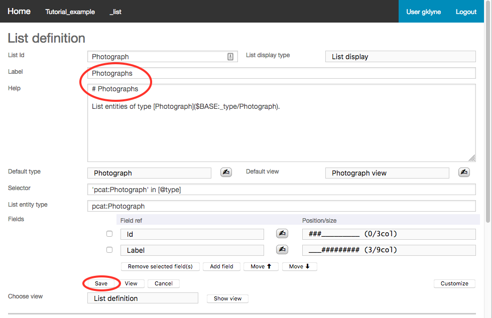

Click `Save` again to save any final changes to the type description and return to the "Type list" display.

== Define namespace URI

We have introduced a new namespace prefix, `pcat`, for terms (such as the type identifier `pcat:Photograph`) used to describe photoraphs.  To be usedful as linked data on the web, this prefix needs to be associated with a URI.  To to this, from the "Customize" page, in the line labeled "Namespace definitions:", click on the link "this collection only".

[.text-center]
.List namespaces in Annalist collection
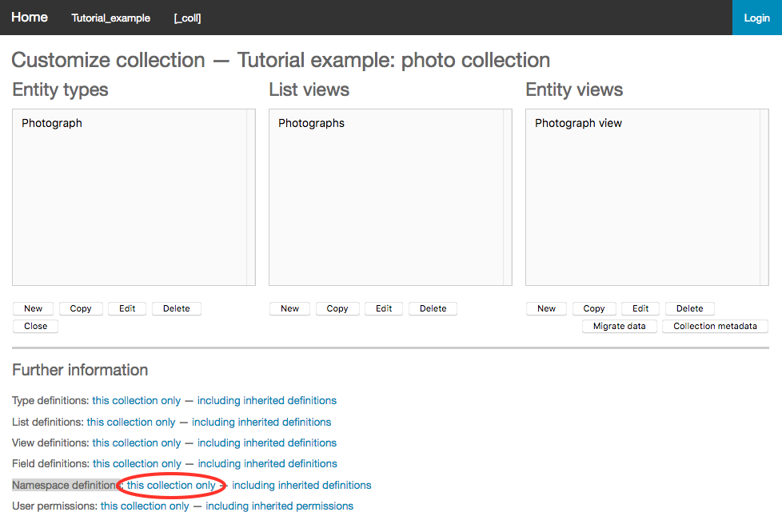

In the next screen click on `New`:

[.text-center]
.List namespaces in Annalist collection
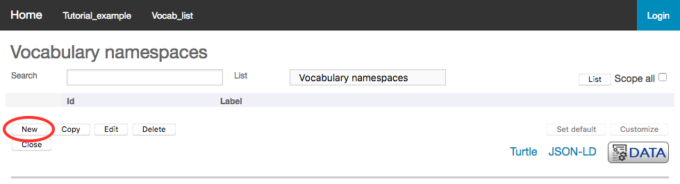

In the next screen, enter the namespace prefix as id, and provide a value for the namespace URI.  Use a URI that you can control, of for the time being use a placeholder in the `example.org` domain.  Provide a label and description for the namespace, and cick `Save` to save the details in the Annalist collection.  The "See also" field might be used to link to documentation of the namespae terms, if any is available.

[.text-center]
.Enter details of new namespace and save
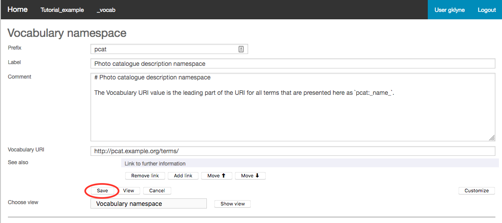

The list of namespaces is redisplayed, with the new namespace included.

[.text-center]
.List updated namespaces in Annalist collection
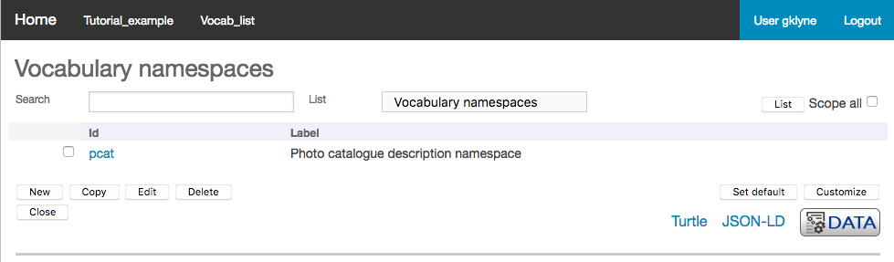

== Create some initial data records

Switch to a listing of "Photograph" records by selecting `Photographs` from the `List view` selector, and then click on the `List` button:

[.text-center]
.List updated namespaces in Annalist collection
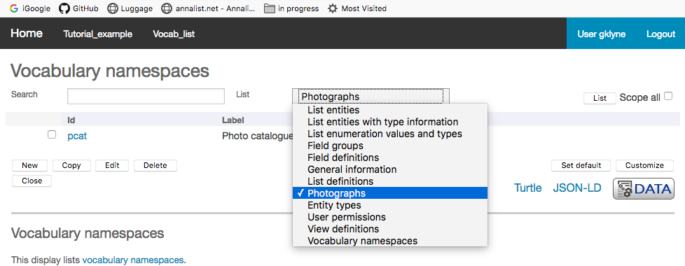

An empty list of photographs should be displayed:

[.text-center]
.Initial, empty, list of Photographs
image::screenshot-list-photographs-empty.png[Initial, empty, list of Photographs,width=640,align=center]

Click on the `New` button to bring up an initial form for enterimng details about a photograph.  New record views contain a number of common fields: `Id`, `Type`, `Label` and `Description`.  Only the `Id` field and `Label` fields are mandatory; the others are defined because they are commonly useful.  The `Id` field is used internally to identify the record, and is used in forming a URL that can be used to access the data.  The `Label` field provides a summary description of the record used in lists and drop-down selectors.

Enter some descriptive data into the fields and click `Save`.

[.text-center]
.Creating new Photograph record
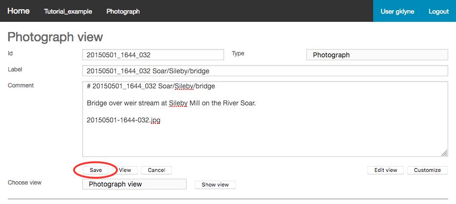

This process can be repeated for additional photographs.

[.text-center]
.List of Photograph records
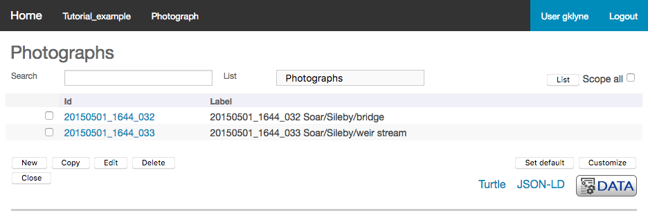

== Add simple fields to a data record

The default view fields presented when creating new records suggest a minimum amount of information to appear in a record.  For many practical purposes, additional fields will be required.  In the case of a photograph, one might wish to have separate fields to record when and where it was taken.  New fields can be added to a view at any time by editing the view description.

There are several ways to edit a view description:

* Select `List views` in the `List view` dropdown, click `View`, then select the view to edit from the displayed list and click `Edit`
* Click `Customize` on any list display, select the view to edit from from the column headed `Record views`, and click on the `Edit` button below.
* Display an instance of the view to be edited (e.g. a view of one of the Photographs in the list of photographs) by clicking on an `Id` link in the list, then click on the `View description` button and finally click on the `Edit` button of the pages displayed.

The following screenshots illustrate the last of these approaches.  First click on an entry to view its data:

image::screenshot-view-photograph-1.png[View a Photograph record in Annalist,width=640,align=center]

Then click on `View description`:

image::screenshot-view-photograph-view.png[View description of view of photograph in Annalist,width=640,align=center]

Then click on `Edit`:

image::screenshot-edit-photograph-view.png[Edit description of view of photograph in Annalist,width=640,align=center]

To add a "Date" field: click `Add field`.  A new row is added to the list of fields, with unspecified values for `Field id`, `Property` and `Position/size`. Clicking on the `Field id` value lists a few options, but none of these suggests a "Date" value.  A new type of view field is required here, so click on the image:button-new-entity.png[] button:

image::screenshot-edit-photograph-view-new-field.png[Adding a new field to the Photograph view,width=640,align=center]

This opens a new form to define details of a new field type.  Fill in information for `Id`, `Render type`, `Label`, `Help`, `Property URI`, `Entity type`, `Value type`, `Value mode` and `Placeholder` as shown.  In ths case, the other fields should be left unspecified.  (The meanings of all these fields are described in link:../view-field-types.adoc[View fields in Annalist].)

[.text-center]
.Defining a new view field type for date
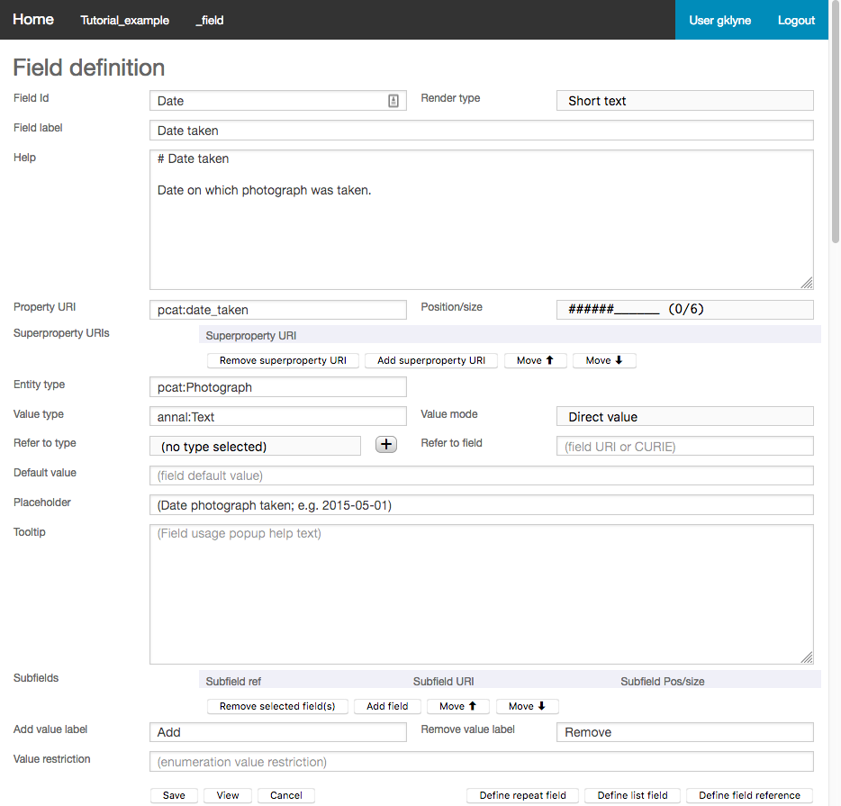

When done, click `Save`, which returns to the previous view editing form.  Now, clicking in the `Field id` includes an option for the new "Date taken" field.  Choose this.  The `Property` and `Posityion/size` columns can be left blank to use values from the field definiotion, or overriding values for the current view can be specified here.  Select an appropriate value (`0/6`) for `Position/size`.

Repeat the above process, starting with `Add field`, to define a new field for the location that a photograph was taken:

[.text-center]
.Defining a new view field type for place
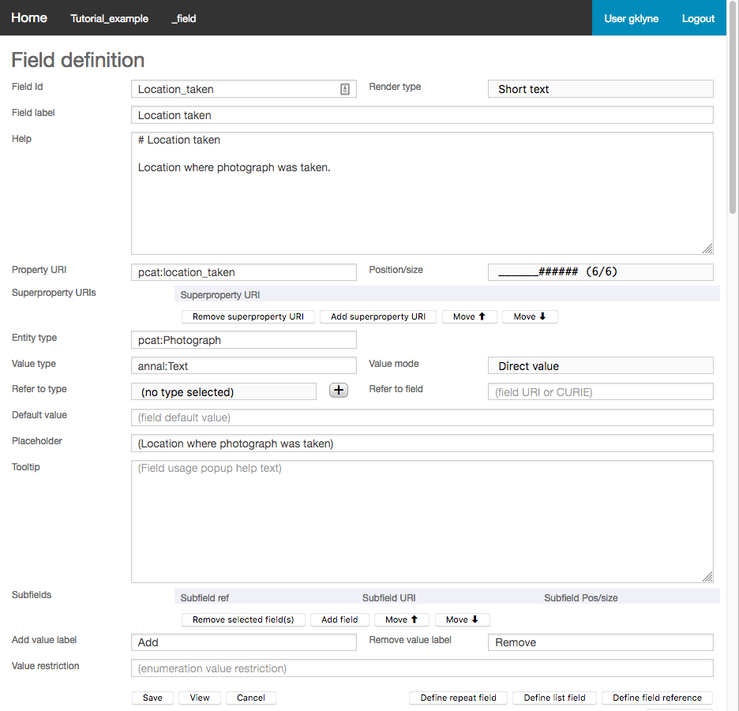

Returning to the view edit form, the new location field can be selected and its position/size specified.  Next, select the two new fields and click the `Move &#x2b06;` button so that they appear immediately after the `label` field.

[.text-center]
.New fields added to Photograph view
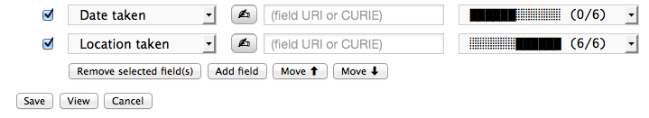

Click `Save`, then `Close` to return to the view of a Photograph, which should now look like this:

[.text-center]
.Updated view of a Photograph record in Annalist
image::screenshot-view-photograph-2.png[Updated view of a Photograph record in Annalist,width=640,align=center]

If the view is now edited, values for the date and location fields can be entered:

[.text-center]
.Adding new field values to a Photograph record
image::screenshot-edit-photograph-2.png[Adding new field values to a Photograph record,width=640,align=center]

These new fields are clearly intended to hold specific types of value (date, location) and the examples suggest particular formats be used for them.  But as far as Annalist is concerned, these are just simple text fields, and no attempt is made to check the format of any values entered.  This is consistent with the Annalist pholosophy of making it easy to capture whatever data may be available with a minimum of hindrance to the user.  The intent is that issues of consistency and data quality may be checked separately according to whatever criteria are deemed appropriate to the task at hand.

== Upload images to a collection

A glaring omission from the record of a photograph created thus far is the photograph itself.  Annalist supports a notion of "attachments", which are arbitrary files that are stored with an Annalist data record, and are made visible through appropriately defined fields, and which may also be accessed directly by Annalist-mediated URLs.  Field definition options allow attachments to be uploaded via the browser from the user's local file system, or imported from a web site.  This example uses file uploads.

The steps for adding an image attachment to a record are:

. Define a new field type for the upload imaged file
. Add the new field to the Photograph view description
. Edit Photograph records and upload images

There are several ways to accomplish these steps (see previous section).  The following example goes via the "Customize" page, starting from the "List of photographs" page:

[.text-center]
.List of Photographs
image::screenshot-list-photographs.png[List of Photograph records in Annalist collection,width=640,align=center]

Click on the `Customize` button:

[.text-center]
.Customize collection page
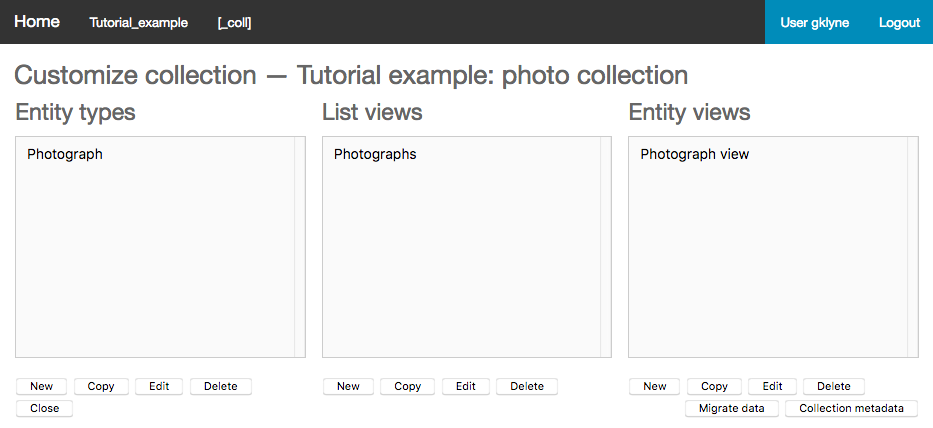

=== Create a new field definition for images

Select "Photograph view" in the "Entity views" column, and click the `Edit` button.  On the resulting view description page, click `Add field`, and then on the `+` button beside the newly added field:

[.text-center]
.Add new field
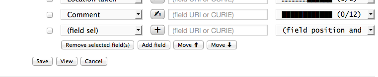

Fill in details for the new field as shown:

[.text-center]
.New image field details
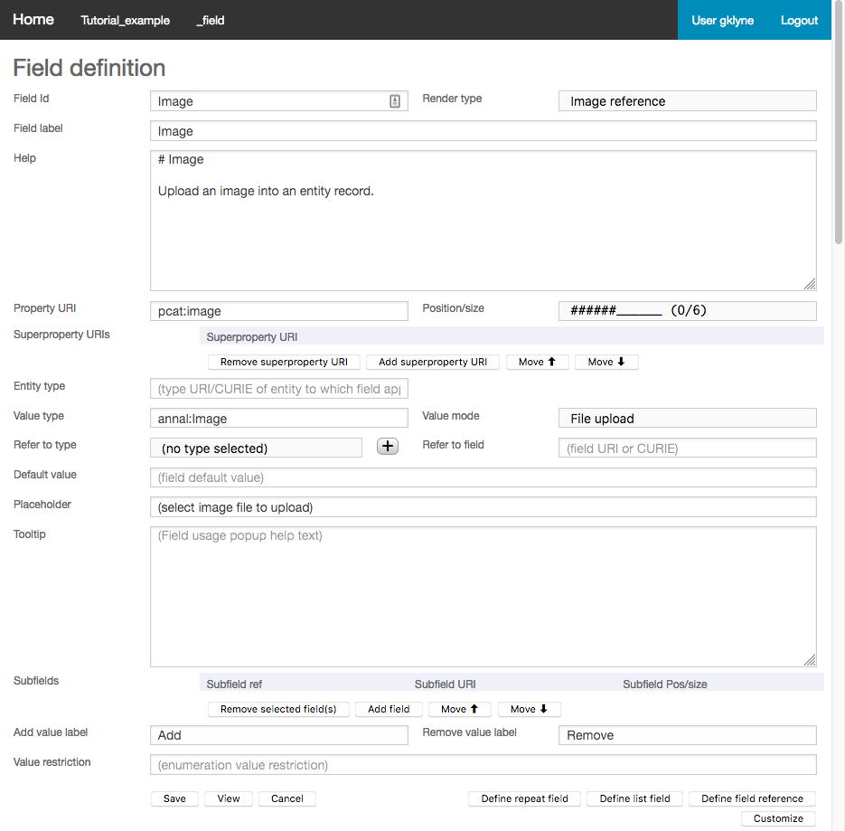

The key fields to note here are:

* `Render field type`: the value `Image reference` indicates the field value is a reference to an image file.
* `Value mode`: the value `File upload` indicates the referenced image will be an uploaded file.

With the field details entered, click 'Save' to return to the view editing form.

=== Add new image field to view description

Select Field Id `Image` for the newly added field, select a value for size/position, click `Save` to return to the `Customize page`, and `Close` to return to the list of photographs:

[.text-center]
.New "Image" field added
image::screenshot-edit-photograph-view-4.png[Photograph record with "Image" field added,width=640,align=center]

=== Upload image to Photograph record

To upload an image, click on the link for a photograph, then click `Edit`;  the photograph editing form, is displayed, now with an additional `Image` field with a `Browse` button:

[.text-center]
.Edit photograph record with Image field
image::screenshot-edit-photograph-3.png[Edit Photograph record with Image field,width=640,align=center]

Click `Browse`, select an image file to be uploaded, then `Open` (or equivalent for the browser being used).  On the photo editing page, click `Save`.  The Photograph record is now displayed with the uploaded image:

////
@@ Temporary reference to develop branch
////

NOTE: The images used for this tutorial example can be found in the Annalist GitHub repository, https://github.com/gklyne/annalist/tree/develop/documents/tutorial/photos[documents/tutorial/photos directory].  They may be downloaded from there to any convenient location on your computer.

////
@@ Use this when updated tutorial is on master branch

NOTE: The images used for this tutorial example can be found in the Annalist GitHub repository, https://github.com/gklyne/annalist/tree/master/documents/tutorial/photos[documents/tutorial/photos directory].  If you are working through the tutorial, they may be downloaded from there to any convenient location on your computer.
////

[.text-center]
.View photograph record with uploaded Image
image::screenshot-view-photograph-3.png[View photograph record with uploaded Image,width=500,align=center]

Clicking on the displayed image here will show the image alone in a new tab (or possibly a new window, depending on the browser used), occupying the full browser window.

@@@@@@

== Add repeating fields to a data record

Sometimes, it is desirable to have a field or group of fields in a record that can be repeated an arbitrary number of times.  We have already seen this when editing a view description which may contain an arebitrary number of fields.  Annalist implements such repeated fields as a special type of field that itself contains references to other fields via a "Field group" description.

Thus, to create a repeating field or group of fields within a view, the following must be defined:

. One or more ordinary individual fields that are to be repeated.
. A field group that references the field(s) that are to be repeated.
. A repeating-value field that references the field group.

Annalist provides a short-cut for creating these various descriptions in the form of a "task button" that appears on the field description editing form.

For our example, we create a field that allows multiple keywords to be associated with a Photograph, starting with a view of a photograph record.  Click on `View description`, then on the next page displayed click `Edit`, `Add field`, and then on the image:button-new-entity.png[] button by the newly added field.

Now fill in details for a single keyword field, as shown.  When the details have been entered, click on `Define repeat field`.

[.text-center]
.New keyword field details
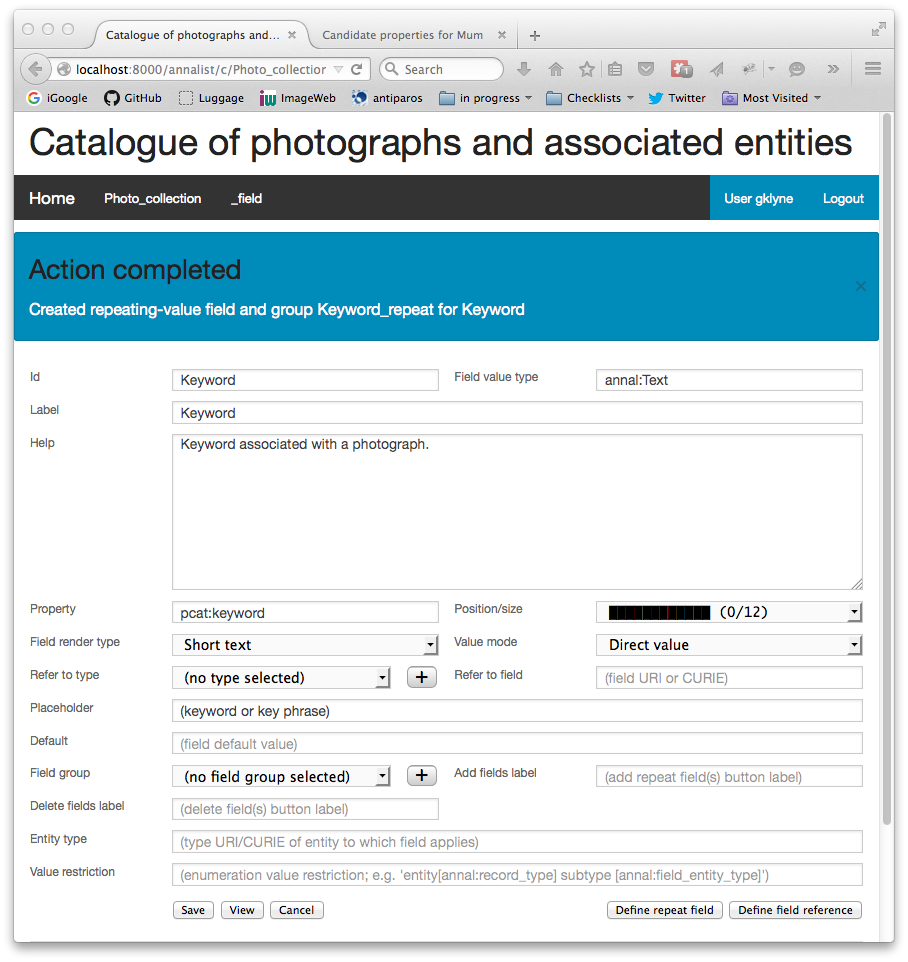

Now click on `Save`, and select `Repeat field 'Keyword'` for the new field id.

[.text-center]
.New "Repeat field 'Keyword'" field added
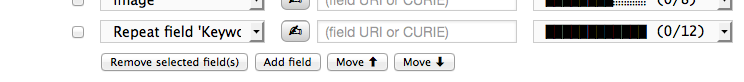

The repeat field structure just created is perfectly functional, but the automatically generated label field could be improved.  Click on the image:button-edit-entity.png[] button by the "Repeat field 'Keyword'" id.  Change the `Label` and `Placeholder` fields as shown, then click on `Save`:

[.text-center]
.Edit labels used with "Keyword_repeat" field
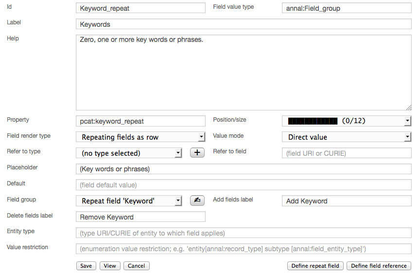

On reeturning the the view editing form, noteice that the selection label for the newly added field is changed to "Keywords":

[.text-center]
.New field label updated
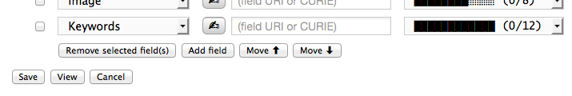

Click `Save` then `Close` to return to the Photograph record view.  To add some keywords, click `Edit`, then `Add keyword`, and fill in key word or phrase text.  repeat for as many keywords as desired:

[.text-center]
.Edit photograph record keyword fields
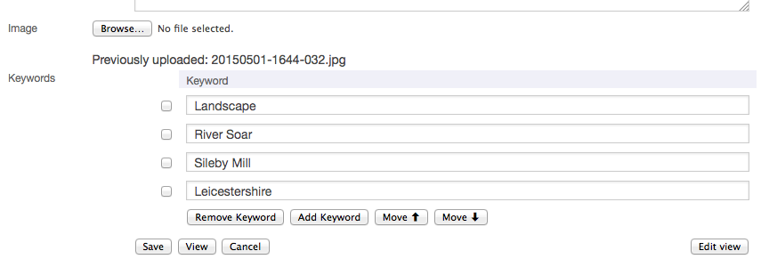

Click on `Save` to view the resulting record:

[.text-center]
.View photograph record keyword fields
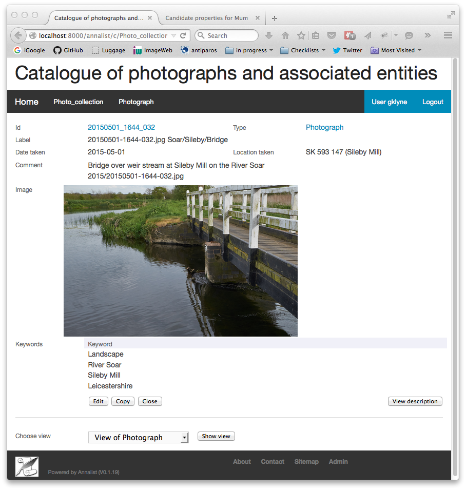

== Create an additional data type (with view+list)

The examples so far have been based on a single "Photograph" entity type.  Many interesting data collections consist of multiple cross-referenced entity types.  For example, we can create "Location notes" records to hold information about where photographs were taken.

Start by creating a new Type, with corresponding View and List definitions; e.g.

. Click on `Photo_collection` in the top menu bar
. Select `List types` from the `List view` drop-down, then click `View`
. Click on `New` to create a new Type
. Enter details as shown
. Click `Save`, then select the newly created type and click `Edit`.  (@@This step is a workaround for a bug in the Define view+_list handler, and should not be needed.)
. Click on `Define view+list`
. Click on `Save`

[.text-center]
.Create new type Location_notes
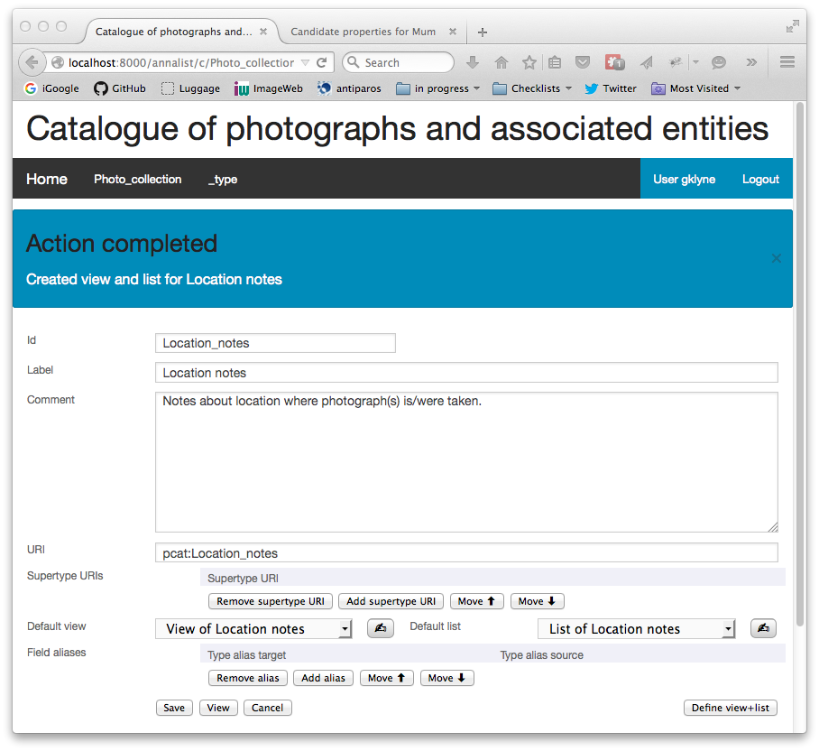

Next, edit the Location notes view to include a map reference field:

. On the `List types` page, click on the link `Location notes`.
. Click on the link `View of Location notes`
. Click `Edit`
. Click `Add field`
. Click the `+` button by the newly added field
. Fill in details of the new field as shown.
. Click `Save`
. Select `Map reference` for the field id of the newly added field, and a value for Position/size.
. Click `Save`, then `Close` to return to thelist of views.

Now we can create an instance of the new type:

. Click on `Photo_collection` in the top menu bar
. Select `List of Location notes` from the `List view` drop-down, then click `View`
. Click on `New` to create a new `Location notes` record

[.text-center]
.Create new map reference field
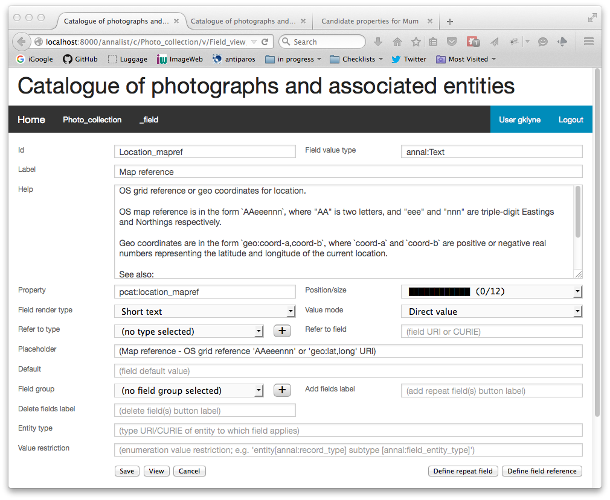

A similar process is repeated, but this time also using the `Define repeat field` button, to create a repeating field of links to further information about the location:

[.text-center]
.Create new web link field
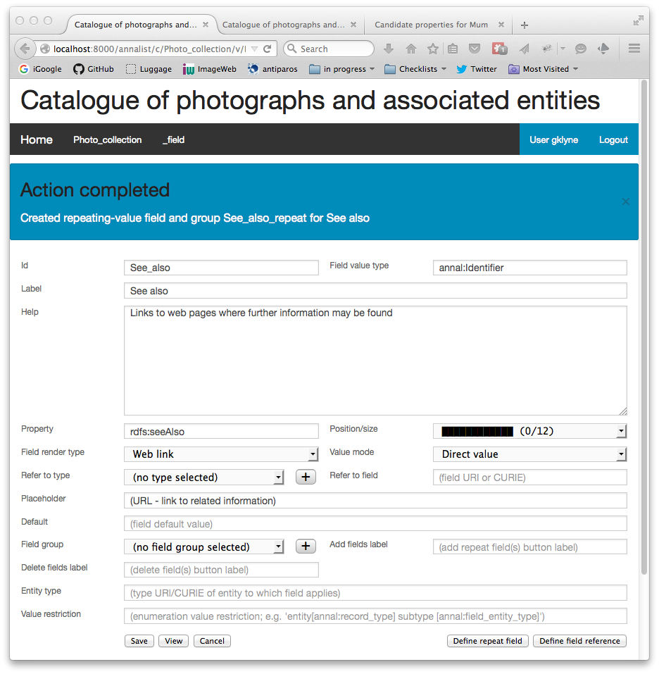

[.text-center]
.Further information field
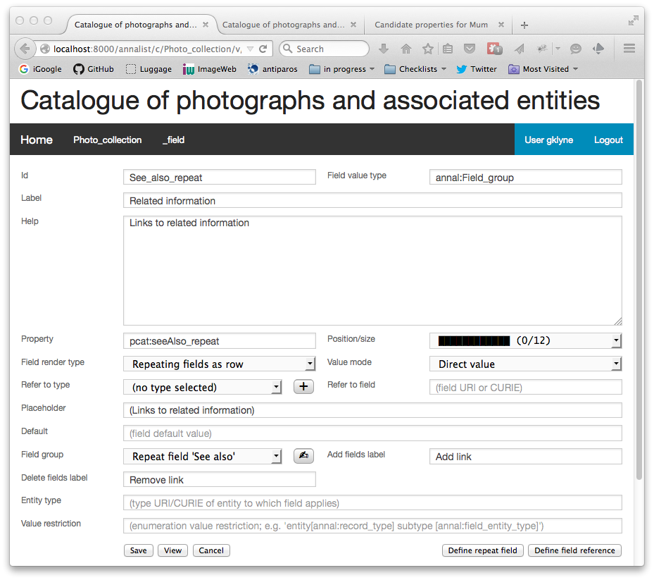

Now the new fields can be configured in the `Location_notes` view:

[.text-center]
.Location notes view with map reference and further information fields
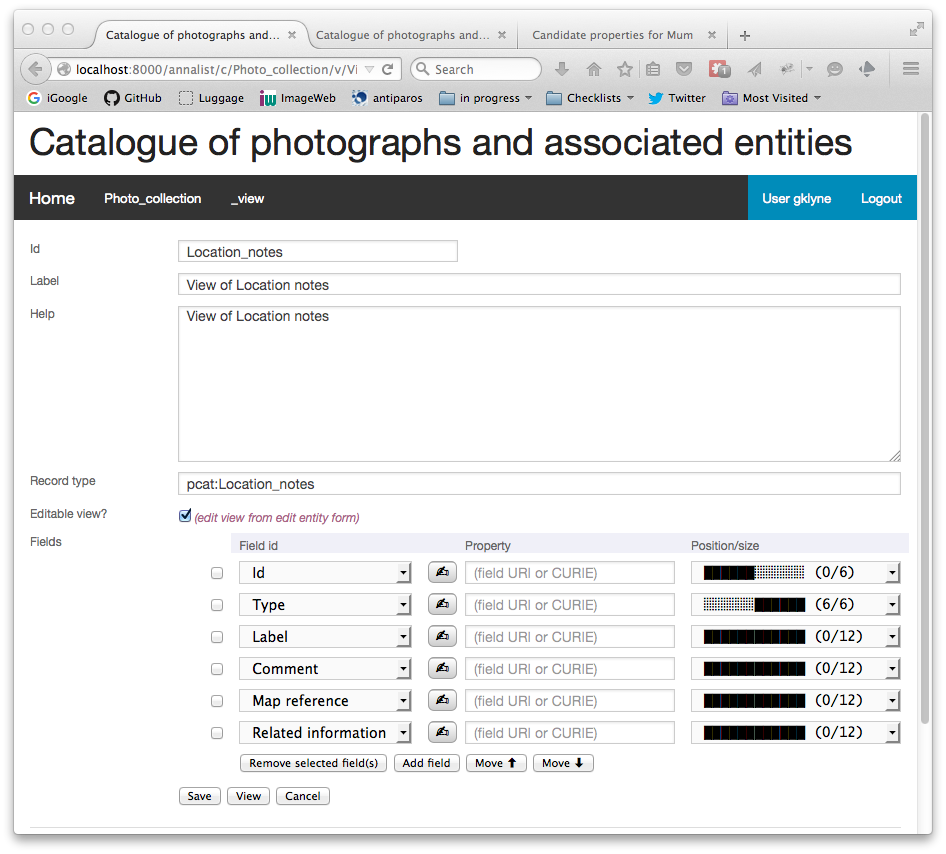

A Location notes record can now be created with data for the additional fields:

[.text-center]
.Create a location notes record
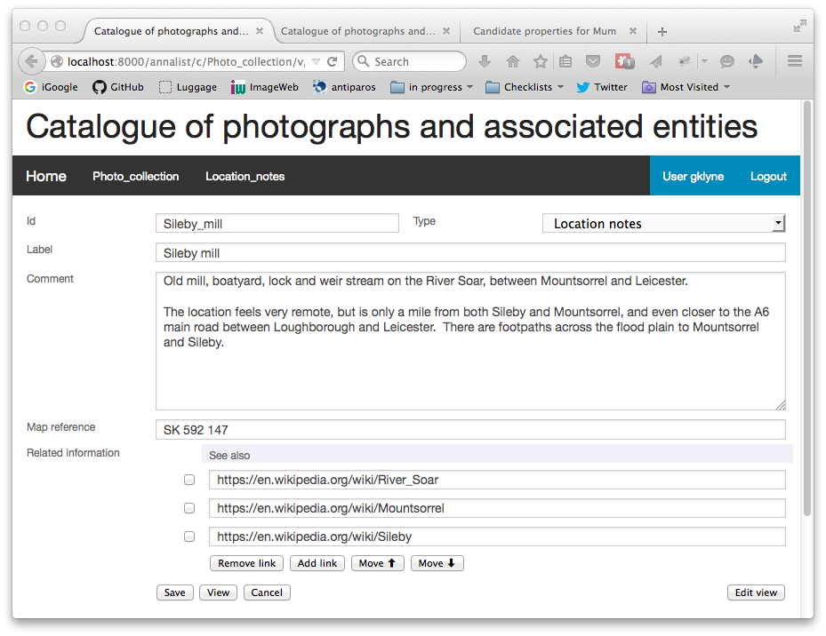

== Create links between records

The preceding section created a new entity type for location notes. Here, we edit the Photograph view to allow each photograph to be linked to notes about the location where it was taken.  This will be achieved by changing the type of `Location_taken` field from a simple text field to a reference to a `Location_notes` field.

To do this, open up the form for editing the view description `Photograph` (using any of the navigation paths described previously).  Then click on the writing hand button beside thefield id "Location taken":

[.text-center]
.Edit field "Location taken" in Photograph view
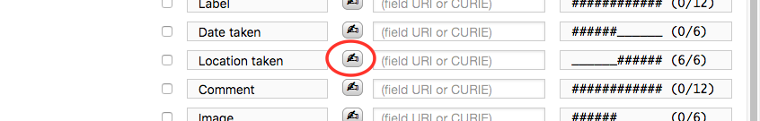

Edit the "Location taken" field as shown beloiw, noting particularly values entered in these fields:

* Field value type - same as the URI given in the `Location_notes` type record (currently not used other than for documentary purposes)
* Field render type - `Optional entity ref` presents a dropdown of entities to which the field may link
* Value mode - `Entity reference` indicates this field is a reference to some other Annalist entity in the current collection.
* Refer to type - `Location notes` indicates the type of entity to which this field may link.

[.text-center]
.Edit field definition for Location taken
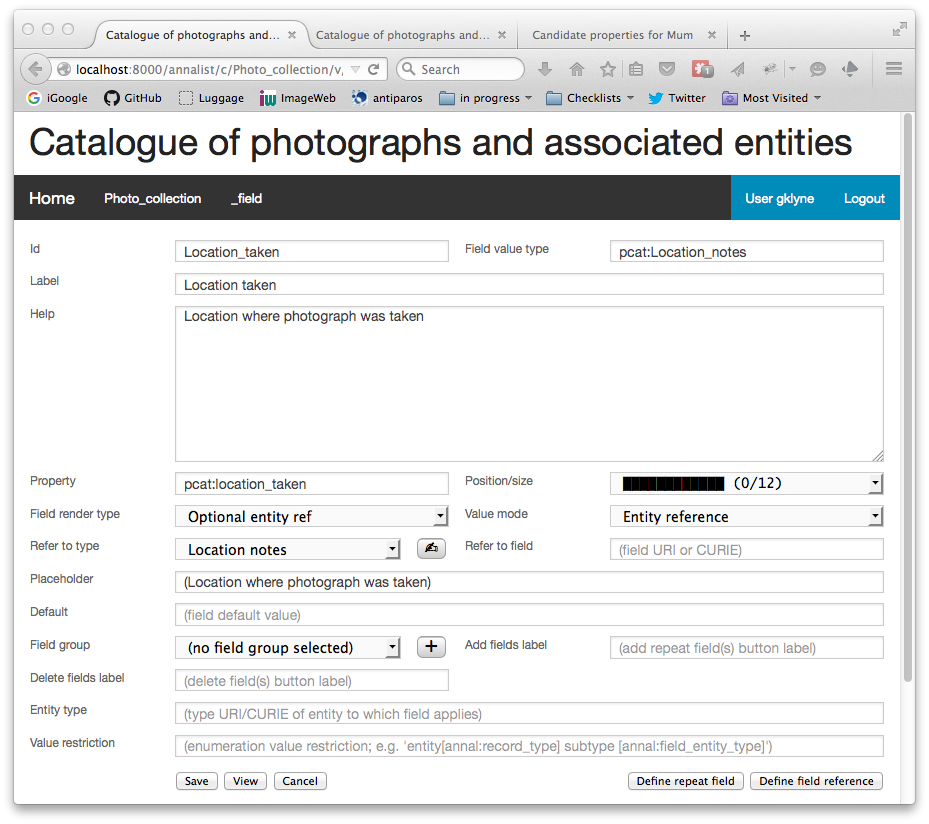

Save the updated field and view descriptions, and redisplay one of the Photograph records:  note that the `Location taken` value is still displayed, but is rendered in a style used for non-existent entity references.  Click on `Edit` to edit the record data, and select the vcalue `Sileby Mill` from the dropdown (corresponding to the previously created `Location notes` record).

[.text-center]
.Select location notes record from dropdown
image::screenshot-edit-photograph-view-8.png[Select location notes record from dropdown,width=500,align=center]

Click `Save` to return to the Phbotograph view, and note that the `Location taken` field now displays as a link to the selected `Location notes` record

== Display fields from a linked record

Rather than just a link to a related record, it is sometimes useful to display one or more values directly from such a record.  For the present example, the photograph "location taken" field is modified to display a link, description and map reference for the location in the photograph view.

This kind of display is created using a `Fields of referenced entity` field type.  This is a special kind of view field that behaves very differently in edit and view modes:  in edit mode, it works just like an `Optional entity ref` field, allowing the user to select an instance of some designated type.  But in view mode, it displays one or more fields from the referenced entity.

First, navigate to a field description in the `Location_notes` view; e.g. from any photograph view, click `View description`, `Location taken`, `Location notes`, `View of location notes` `Map reference` and `Edit`.

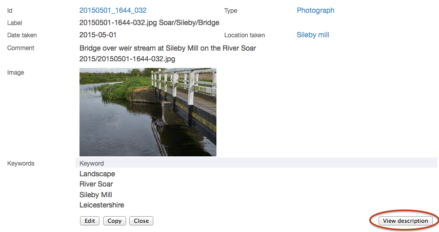
image:screenshot-view-photograph-view-2.png[View of photograph view description,width=400]
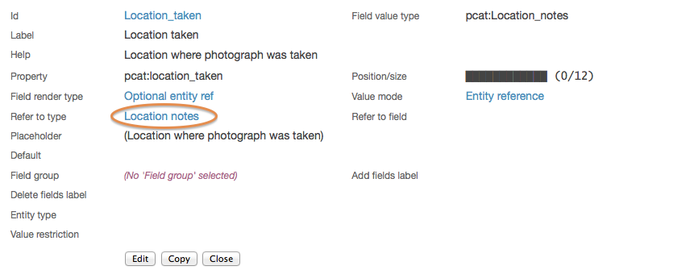
image:screenshot-view-location_notes-type-1.png[View location notes type description,width=400]
image:screenshot-view-location_notes-view-1.png[View location notes view description,width=400]
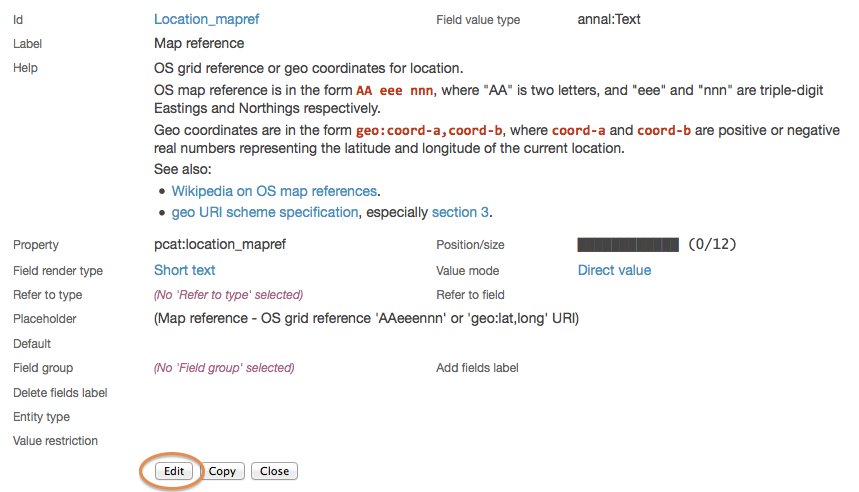

[.text-center]
.Navigate to edit form of "map reference" field
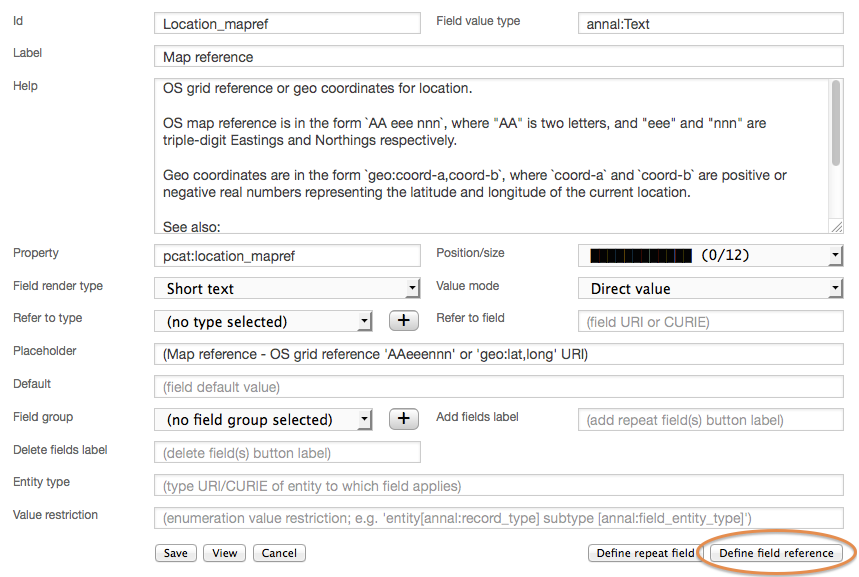

An alternative to this slightly long winded navigation path would be to go to the collection front page (click `Photo_collection` in the menu bar), select `List fields` from the `List view` selector, cick `View`, click on `Location_mapref`.  Either way, the resulting page should look something like the last screenshot above.  

In the form displayed, click `Define field reference`:  this will create a new field and field group `Location_mapref_ref` referencing this field, and display an editing form for the new field definition.
Before making any changes to the field itself, click on the image:button-edit-entity.png[] button by the `Field group` field:

[.text-center]
.Edit location notes reference field
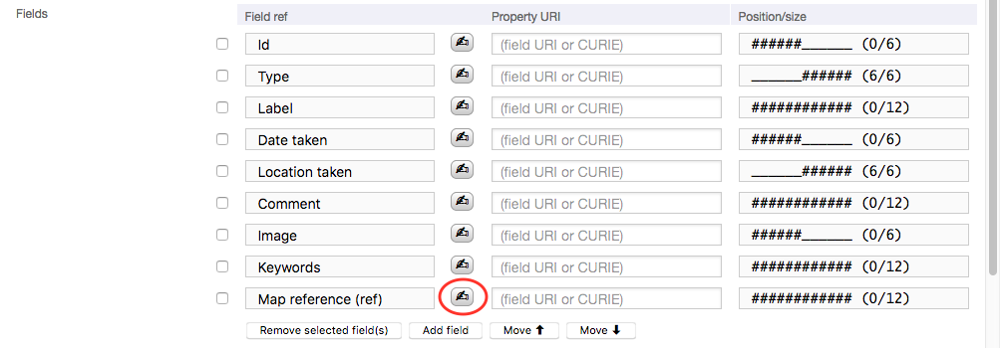

This will display a new form for editing details of the new field group.  In this form:

. Add additional fields `Id` and `Label` to be displayed, using the `Add field` button and the new field id selectors dislayed.
. Move the two new fields in front of the map reference field by selecting their checkboxes and clicking `Move &#x2b06;` button.
. Make changes as desired to the field label and description (but leave other fielkds as they are).
. Click `Save` to save the changes and return to the new field definition that references this group.

[.text-center]
.Edit new field group
image::screenshot-edit-location_notes_ref-group-1.png[Edit new field group,width=500,align=center]

Back in the field editing form, change the Id, label and description and property URI of the new field to better reflect its actual usage.  Then click `Save`.

[.text-center]
.Edit new location notes reference field
image::screenshot-edit-location_notes_ref-field-2.png[Edit new location notes reference field,width=500,align=center]

At this point, navigate to the view description for Photograph (e.g. by displaying a Photograph record and clicking on `View description`, or selecting and displaying `List views` from the collection home page and then clicking on `Photograph`).  Then click on the `Edit` button to display the view editing form.  On this form, clicik `Add field`, select the newly created `Location notes` field type, and select `0/12` for the position/size value:

[.text-center]
.Add location notes field to photograph view
image::screenshot-edit-photograph-view-9.png[Add location notes field to photograph view,width=500,align=center]

Click on `Save`.

Now navigate to a view of a photograph record, click `Edit` and inthe displayed form select a value for the new field `Location notes` from the dropdown displayed.

[.text-center]
.Select value for Location notes field
image::screenshot-edit-photograph-6.png[Select value for Location notes field,width=500,align=center]

Click `Save` to view the photoigraph records, and observe that the `Location notes` field now displays three values from the selected record:

[.text-center]
.View photograph record with location notes
image::screenshot-view-photograph-6.png[View photograph record with location notes,width=600,align=center]

// MORE TO COME, AS NEEDED.

////
== Creating simple entity type hierarchies

@@TODO

@@ (e.g. subjects -> people / places / events)

== (Any more?)

@@TODO
////
