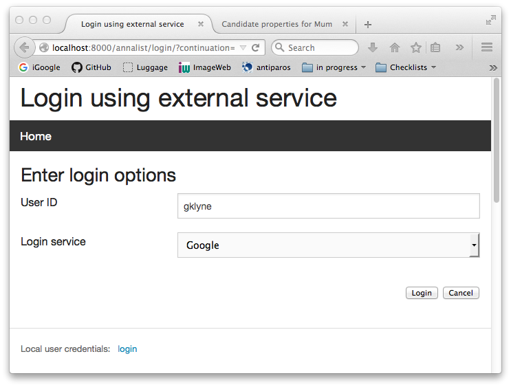
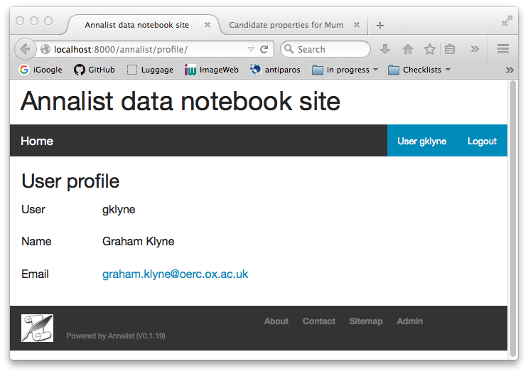
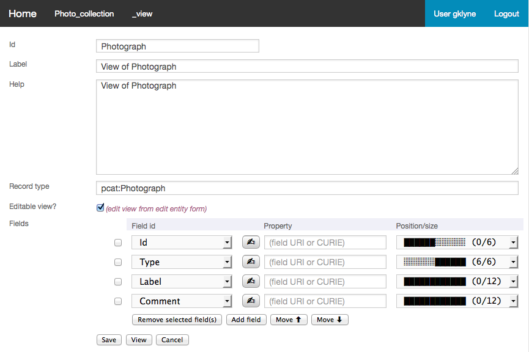
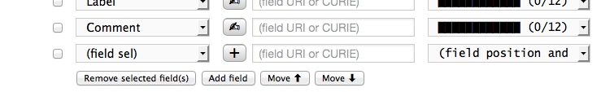
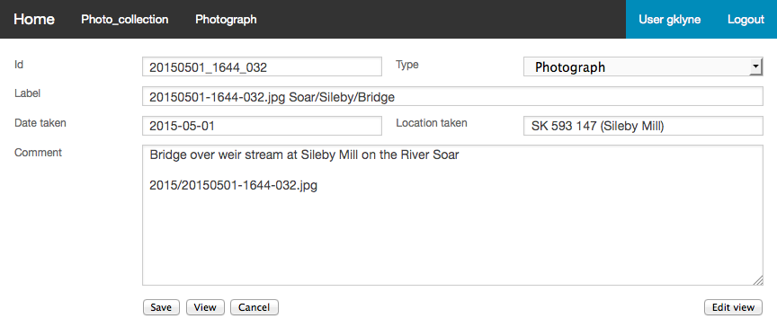

= Annalist tutorial
Graham Klyne
v0.1.20, 2015-09-25
:toc: macro
:toc-title:

This document provides a task-oriented introduction to using Annalist.  It assumes Annalist has been installed or deployed, and provides step-by-step description of how various data management tasks can be performed using Annalist.

*Table of Contents*

toc::[]

== Running example

This tutorial uses a running example of a personal photograph library, starting with a simple catalogue of images and some associated metadata, and then adding additional structures to cross reference other entitiues involved in the picture-taking process.

The final example can be seen at the http://demo.annalist.net/[Annalist demo site], as collection [Annalist photo collection].  (@@TODO)

== Log in to Annalist

Browse to the Annalist site login page; e.g. http://demo.annalist.net/annalist/site/, then http://demo.annalist.net/annalist/login/.

The first time of logging in to an Annalist site from some computer will involve some or all of the following.

* select a User ID
* enter User ID into login form
* select "Google" for the Login Service
* click "Login"

At this point the browser is redirected to Google's own login page to enter account credentials, and maybe also a 2-factor authentication code.  Once the authentication credentials have been entered and verified, Google may then ask for your permission to disclose information to the Annalist application.  The information to be disclosed is described;  Annalist uses only the email address, which is used in conjucntion with the User ID entered to select a set of user permissions (see "User permissions" section).

****
@@When alternative ID provders are supported, note this
****

If the User ID has already been used by a different user, a message is displayed (@@ message text)

After the first time, use the same details and click "Login".  Typically, if this is a personal machine you have used before, the login will complete without any further interaction.

[.right.text-center]
.Annalist login form

The login sequence associates an authenticated email address with the User ID given, which is used to determine appropriate access permissions (see "User permissions" below).

[.right.text-center]
.Annalist logged in

Once the login is complete, click on "Home" in the menu bar to return to the main Annalist site

[.right.text-center]
.Annalist home page

=== Using public computers

If you login from a public computer, remember to log out from your identity provider when you have finished using Annalist and before leaving the computer.

****
@@details for logout from Google.
****

=== Local authentication

****
@@Update this when "Local" is implemented as a login service
****

Annalist has been designed to use third party authentication.  This avoids having to deal with the tricky technical and operational difficulties of managing password files;  leaked password files are a very common form of security failure, so by leaving this to the ID provider professionals, user security should be improved.  This also allows users to log in using an existing account rather than having to allocate and remember a new password for Annalist.

Sometimes (for example when Annalist is required to be usable when not connected to the Internet), it may be preferred to use locally managed passwords.  Annalist can use the local password management and login features of the Django web application platform on which it is built.

When installing Annalist, an administration account may be created using the `annalist-manager` tool.  When logged in to Annalist using this account, the *Admin* link in the footer of most Annalist pages will allow new user accounts to be created via the Django admin interface.  More documentation about using this admin interface is in the http://www.djangobook.com/en/2.0/chapter06.html[The Django Admin Site], which is Chapter 6 of http://www.djangobook.com/en/2.0/index.html[The Django Book].

To log in using a Dango account clock on the "Local user credentials" `login` link, and enter a Django username and password into the new page that is displayed.  Once logged in, return to the Annalist site "Home" page 

[.right.text-center]
.Annalist local login form
image::screenshot-login-django.png[Annalist local login form,width=400]

== User permissions

Annalist keeps a set of user permissions associated with every combination of User ID *and* authenticated email address.

User permissions may be defined site-wide (i.e. they can apply for all collections across a site), or they may be defined separately for each collection.  Thus, different permissions may be granted to different users in different collections.  Permission to create new collections must be site-wide.

Site-wide permissions are defined using the `annlist-manager`command line administration tool, and cannot currently be defined through the web interface.  See link:../installing-annalist.md[Installing and setting up Annalist] for more information about `annalist-manager`, or run the command `annalist-manager help`.

****
@@Update this when the web interface can define site-wide permissions.

@@analist-manager currently has a bare miniumum of capabilities to create users, mainly intended to bootstrap a system with admin users.
****

Within a collection, a user with `ADMIN` permissions on that collection can view the user permissions for the collection in the List view `List users`.  To view the list of user permissions for a collection, browse to that collection which will display some list of records.  In the `List view` dropdown, select option `List users`, and click `View` see see user permissions defined for the collection only, or `View all` to also list site-wide user permissions.

[.right.text-center]
.List user permissions for an Annalist collection
image::screenshot-annalist-permissions.png[Annalist collection user permissions,width=400]

There are two "special" users that are used to select access permissions applied to users for whom no more specific permissions are available:

`annal:User/_unknown_user_perms` defines permissions that are applied for any user who is not logged in to Annalist.  Typically, this might be used to grant public read-only access to a collection.

`annal:User/_default_user_perms` defines permissions that are applied for any user who is logged in to Annalist, but for whom no more specifiuc permissions are granted.  Permissions thus granted are effectively available to anyone who comes to the web site, but any actions they perform are potentially auditable, being associated with an authenticated (by Google) email address.

New permissions may be added from the "List user permissions" page by clicking `New`:

[.right.text-center]
.Creating new user permissions for an Annalist collection
image::screenshot-annalist-permissions-new.png[Annalist collection new user permissions,width=400]

The `User Id` field corresponds to the User Id entered in the login page.

The `URI` field (usually a `mailto:` URI) corresponds to the authenticated email address provided by the identity service (e.g. by Google).  In principle, other forms of URI might be authenticated by an ID service, but this is not currently part of the OpenId Connect protocol used.

The `Permissions` field is a list of tokens (names) corresponding to permissions granted to this user.  For the permissions to apply, both the user ID used to log in and the authenticated email address must match the `User Id` and `URI` fields.

The standard Annalist permission tokens include:

`ADMIN` - required to create or view user permissions in a collection.  The creator of a collection is automatically granted `ADMIN` permissions over that collection, so they can assign permissions in that collection for other users.  This permission at site level also allows creation and deletion of collections.

`CONFIG` - required to change the structure of a collection: to create and/or modify record types, views, lists, etc.

`CREATE` - required to create new data in a collection.

`UPDATE` - required to edit data records in a collection.

`VIEW` - required to view or read data records in a collection.

`DELETE` - required to remove data records in a collection.

`CREATE_COLLECTION` - this permission, or `ADMIN`, is required at site level to create a new collection.

`DELETE_COLLECTION` - this permission, or `ADMIN`, is required at site level to remove an existing collection.

(Future developments may allow for the introduction of additional tokens on a per-collection basis, but for now these are all of the available permissions.)

== Browsing an existing Annalist collection

@@TODO

== Creating a new collection

Creating a new collection requires site-level permission `CREATE_COLLECTION` or `ADMIN`.

To create a new collection, go to the Annalist site home page and enter an ID and description for the new collection, and click the `New` button.  The ID must consist of letters, digits and underscore ('_') charafcters only, and be no longer than 32 characters.

[.right.text-center]
.Creating new Annalist collection
image::screenshot-create-collection.png[Creating a new Annalist collection,width=400]

In the updated list of collections, click on the link corresponding to the new collection to view its initial content:

[.right.text-center]
.View new Annalist collection
image::screenshot-view-new-collection.png[Creating a new Annalist collection,width=400]

== Create initial record type and views for the new collection

It is possible to start creating new data records straight away in a newly created collection, using the in-built default type and views.  But for practical use, it is probably better to start by creating a new rtecord type and corresponding views to match the initial data to be collected.

Switch to a listing of record types, by selecting `List types` from the `List view` selector, and then click on the `View` button:

[.right.text-center]
.List record types in Annalist collection
image::screenshot-list-types.png[List record types in Annalist collection,width=400]

Click the `New` button to create a new record type, and enter some details about this record type.  To define initial tailorable view and list descriptions for the new record type, click on the `Define view+list` button.  The `Default view` and `Default list` fields are updated accordingly. 

[.right.text-center]
.Creating new record type, view and list in Annalist collection
image::screenshot-create-new-type.png[Creating new record type in Annalist collection,width=400]

NOTE (there is a possible bug in the software that needs investigating): if an error message is displayed saying the new type already exists, click `Cancel` then select the new type in the "List types" display and click `Edit`.  Then click the `Define view+list` button.

Click `Save` to save any changes and return to the "Type list" display.

== Create some initial data records

Switch to a listing of "Photograph" records by selecting `List of Photograph` from the `List view` selector, and then click on the `View` button;  the initial list should be empty:

[.right.text-center]
.Initial, empty, list of Photographs
image::screenshot-list-photographs-empty.png[Initial, empty, list of Photographs,width=400]

Click on the `New` button to bring uo an initial forkm for enterimng details about a photograph.  New record views contain a number of common fields: `Id`, `Type`, `Label` and `Description`.  Only the `Id` field and `Label` fields are mandatory; the others are defined because they are commonly useful.  The `Id` field is used internally to identify the record, and is used in forming a URL that can be used to access the data.  The `Label` field provides a summary description of the record used in lists and drop-down selectors.

Enter some descriptive data into the fields and click `Save`.

[.right.text-center]
.Creating new Photograph record
image::screenshot-create-photograph.png[Creating new Photograph record in Annalist collection,width=400]

This process can be repeated for additional photographs.

[.right.text-center]
.List of Photograph records
image::screenshot-list-photographs.png[List of Photograph records in Annalist collection,width=400]

== Add simple fields to a data record

The default view fields presented when creating new records suggest a minimum amount of information to appear in a record.  For many practical purposes, additional fields will be required.  In the case of a photograph, one might wish to have separate fields to record when and where it was taken.  New fields can be added to a view at any time by editing the view description.

There are several ways to edit a view description:

* Select `List views` in the `List view` dropdown, click `View`, then select the view to edit from the displayed list and click `Edit`
* Click `Customize` on any list display, select the view to edit from from the column headed `Record views`, and click on the `Edit` button below.
* Display an instance of the view to be edited (e.g. a view of one of the Photographs in the list of photographs) by clicking on an `Id` link in the list, then click on the `View description` button and finally click on the `Edit` button of the pages displayed.

The following screenshots illustrate the last of these approaches.

image:screenshot-view-photograph-1.png[View a Photograph record in Annalist,width=400]
image:screenshot-view-photograph-view.png[View description of view of photograph in Annalist,width=400]

To add a "Date" field: click `Add field`.  A new row is added to the list of fields, with unspecified values for `Field id`, `Property` and `Position/size`. Clicking on the `Field id` value lists a few options, but none of these suggests a "Date" value.  A new type of view field is required here, so click on the `+` button:

This opens a new form to define details of a new field type.  Fill in information for `Id`, `Field value type`, `Label`, `Help`, `Property`, `Field render type`, `Value mode` and `Placeholder` as shown.  In ths case, the other fields should be left unspecified.  (The meanings of all these fields are described in link:../view-field-types.adoc[View fields in Annalist].)

[.right.text-center]
.Defining a new view field type for date

When done, click `Save`, which returns to the previous view editing form.  Now, clicking on the `Field id` value includes an option for the new field type just described.  Choose this.  The `Property` and `Posityion/size` columns can be left blank to use values from the field definiotion, or overriding values for the current view can be specified here.  Select an appropriate value (`0/6`) for `Position/size`.

Repeat the above process, starting with `Add field`, to define a new field for the location that a photograph was taken:

[.right.text-center]
.Defining a new view field type for place
image::screenshot-create-new-field-place.png[Defining a new view field type for place,width=400]

Returning to the view edit form, the new location field can be selected and its position/size specified.  Next, select the two new fields and click the `Move &#x2b06;` button so that they appear immediately after the `label` field.

[.right.text-center]
.New fields added to Photograph view
image::screenshot-edit-photograph-view-2.png[New fields added to Photograph view,width=400]

Click `Save`, then `Close` to return to the view of a Photograph, which should now look like this:

[.right.text-center]
.Updated view of a Photograph record in Annalist
image::screenshot-view-photograph-2.png[Updated view of a Photograph record in Annalist,width=400]

If the view is now edited, values for the date and location fields can be entered:

[.right.text-center]
.Adding new field values to a Photograph record

These new fields are clearly intended to hold specific types of value (date, location) and the examples suggest particular formats be used for them.  But as far as Annalist is concerned, these are just simple text fields, and no attempt is made to check the format of any values entered.  This is consistent with the Annalist pholosophy of making it easy to capture whatever data may be available with a minimum of hindrance to the user.  The intent is that issues of consistency and data quality may be checked separately according to whatever criteria are deemed appropriate to the task at hand.

== Upload images to a collection

The glaring omission from the record of a photograph created thus far is a copy of the photograph itself.  Annalist supports a notion of "attachments", which are arbitrary files that are stored with an Annalist data record, and are made visible through appropriately defined fields, and which may also be accessed directly by Annalist-mediated URLs.  Field definition options allow attachments to be uploaded via the browser from the user's local file system, or imported from a web site.  This example uses file uploads.

The steps for adding an image attachment to a record are:

. Define a new field type for the upload imaged file
. Add the new field to the Photograph view description
. Edit Photograph records and upload images

There are several ways to accomplish these steps (see previous section).  The following example goes via the "Customize" page, starting from the "List of photographs" page:

[.right.text-center]
.List of Photograph records
image::screenshot-list-photographs.png[List of Photograph records in Annalist collection,width=400]

Click on the `Customize` button:

[.right.text-center]
.Customize collection page
image::screenshot-customize.png[Annalist collection Customize page,width=400]

.Create a new field definition for images

Select "View of Photograph" in the "Record views" column, and click the `Edit` button.  On the resulting view description page, click `Add field`, and then on the `+` button beside the newly added field:

[.right.text-center]
.Add new field
image::screenshot-edit-photograph-view-3.png[Add new field to photograph record,width=400]

Fill in details for the new field as shown:

[.right.text-center]
.New image field details

The key fields to note here are:

* `Render field type`: the value `Ref image file` indicates the field value is a reference to an image file.
* `Value mode`: the value `File upload` indicates the referenced image will be an uploaded file.

With the field details entered, click 'Save' to return to the view editing form.  Select Field Id `Image` for the newly added field, select a value for size/position, click `Save` to return to the `Customize page`, and `Close` to return to the list of photiographs.

.Add new image field to view description

[.right.text-center]
.Set details of new field
image::screenshot-edit-photograph-view-4.png[Set details of new field,width=400]

.Upload image to Photograph record

To upload am image, click on the link for a photograph, then click `Edit`;  the photograph editing form, is displayed, now with an additional `Image` field with a `Browse` button:

[.right.text-center]
.Edit photograph record with Image field
image::screenshot-edit-photograph-3.png[Edit photograph record with Image field,width=400]

Click `Browse`, select an image file to be uploaded, then `Open` (or equivalent for the browser being used).  On the photo editomng page, click `Save`.  The photograph record is now displayed with the uploaded image:

[.right.text-center]
.View photograph record with uploaded Image
image::screenshot-view-photograph-3.png[View photograph record with uploaded Image,width=400]

Clicking on the displayed image here will show the image alone occupying a full browser window.

== Add repeating fields to a data record

@@TODO

== Create an additional data type

@@TODO

== Create links to another record

@@TODO

== Display fields from a linked record

@@TODO

@@ Using `RefMultifield` render type, and task button 

== Creating simple record type hierarchies

@@TODO

@@ (e.g. subjects -> people / places / events)

== (Any more?)

@@TODO

