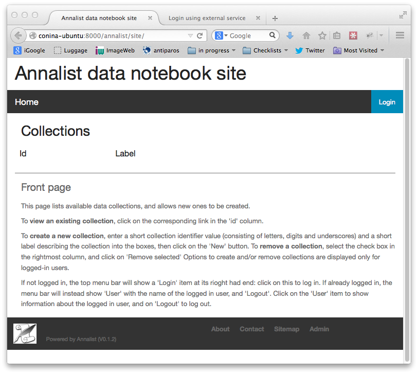
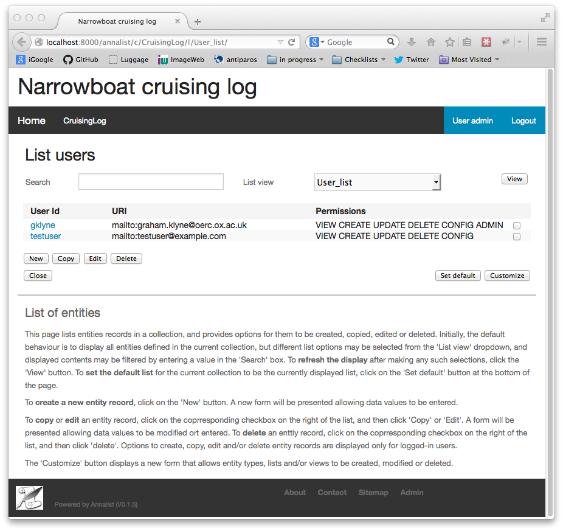
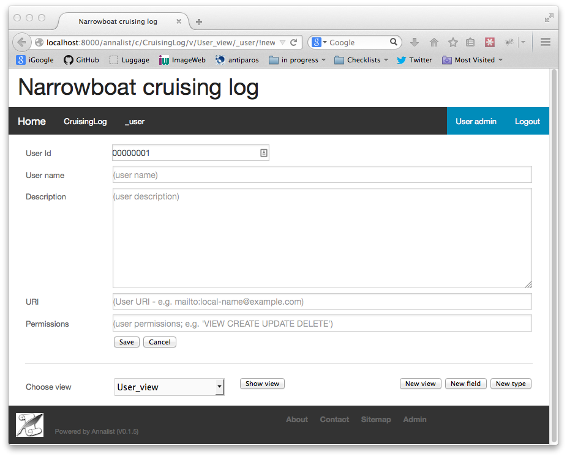
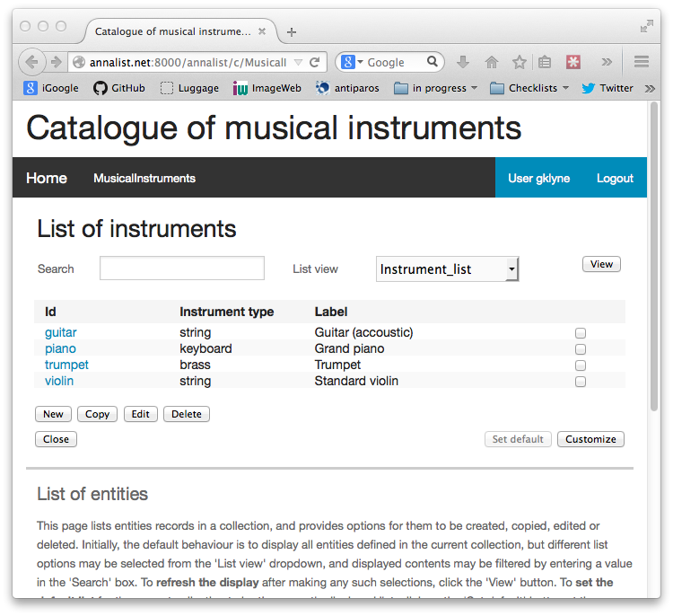
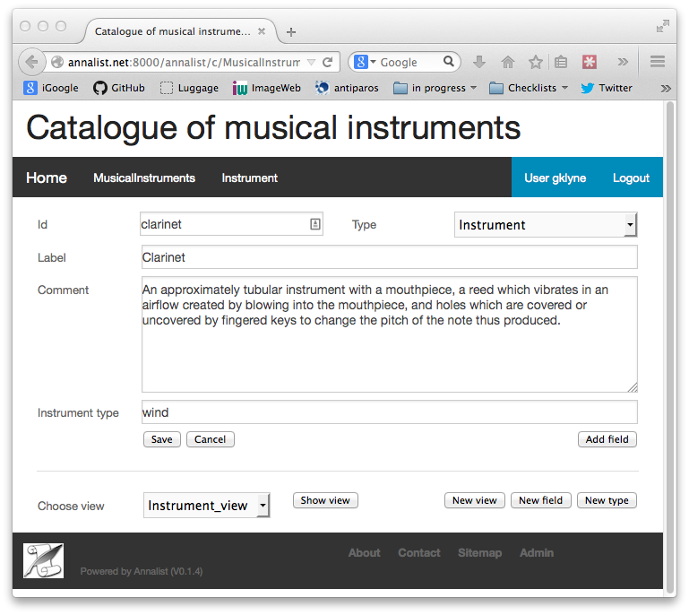
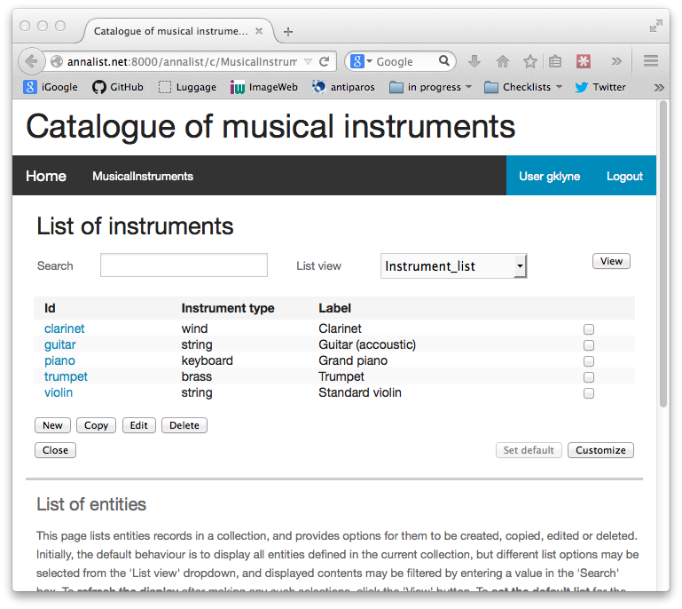
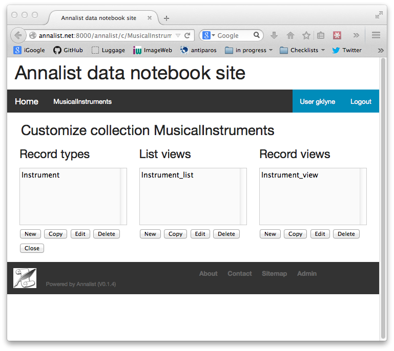

= Guide to using Annalist
Graham Klyne
v0.1.16, 2015-08-04
:toc: macro
:toc-title:

This document provides an initial guide to using Annalist.  It assumes Annalist has been installed or deployed, and provides an overview ofconcepts involved and operations that can be performed using Annalist.

*Table of Contents*

toc::[]

== Concepts

[[annalist-concepts]]
image::figures/annalist-concepts.png[alt="Annalist concepts"]

=== Site

A site corresponds to an Annalist installation.  It may contain any number of data collections.

=== Collections

A *collection* is a grouping of data under a single administrative control (i.e. access control is applied at the level of a collection;  there is no fine-grained access control within a collection.)

=== Data records

A *data record* is a web-accessible unit of user data.   Each data record has an entity identifier and a type identifier;  the combination of collection identifier, type identifier and entity identifier uniquely identify a data record within a site.  Combined with the site's URI, this invormation allows for any data record to have a unique identity on the World Wide Web, which is fundamental to Annalist's support for linked data.

A data record may have any number of properties; new properties may be added at any time to any data record.  Each property is identified by a URI or CURIE (often referred to as URIs).  There may be multiple values associated with any property URI.  This representation of data records with arbitrary properties is at the heart of Annalist's flexibility, and is based on the RDF and JSON-LD data models.  By not imposing any predefined structure, the content of any data record can be varied as needs dictate.  Presented structure is defined, as needed, by views on a data record (see below).

The data type of a property value is not formally constrained.  Multiple instances of the property may have values with different data types.  In practice, the data type associated with a property is determined by the field type (see below) used in the views though which data is entered and/or displayed, and these will generally present and interpret the property value as a particular data type.  If different data types do appear for a single property URI, the view- and list-fields used should be able to handle them appropriately.

=== Record types

*Record types* provide a simple, coarse-grained way of distinguishing different types of record from a user perspective, and associating with different content presentation as appropriate.  Each data record has exactly one data type, which is used directly to help organize the underlying data storage.  The intent is that data types are used to ceate a top-level organization of different kinds of data within a collection.  Finer-grained and cross-cutting type distinctions may be made though properties on each data record.

In keeping with the idea that properties can be added to any data record at any time, the description of a record type does not include any structural information.  Rather, it includes descriptive information, and association with default view and list presentations (other view and list presentations can be used, but must be explicitly selected).

Although record types do not constrain the structure of records, they do define some structure-dependent options that affect the way they are processed:

. each type can indicate any number of supertype URIs.  When lists or view fields are defined to include a particular type, all subtypes of that type (i.e. all types for which the designated type is a supertype) are also included.  This affects entity lists and drop-down lists for enumerated values in entity editing views.

. each type can indicate any number of field aliases.  This allows certain field property URIs to be recognized as aliases for some more commonly used URIs.  For example, `foaf:name` considered as an an instance of `rdfs:label` means that records describing a `foaf:Person` can be included in lists of entities with labels defined by `rdfs:label`.

=== Record views

A *record view* describes a selection and organization of properties to be used when displaying a single data record.  As such, a view establishes a presentation of a particular kind of structure on the data.  Different views may present different structures over the same underlying data.  A view is defined with a number of fields (see below, and also [View fields in Annalist](view-field-types.adoc)).

=== List views

A *list view* describes a selection and organization of data records and properties to be used for displaying multiple data records.  They are used to create summary displays from which individual data records may be selected.  A list is defined with a data record selector and a number of fields (see below).

Associated with each collection is a default list view, which is displayed when a collection is initially accessed.

=== Fields

Record and list views are build up using *fields*, which associate a data record property URI with a field renderer and a stored data value type.  A field render formats data for presentation (essentially as a fragment of HTML), and interprets user input as a storable data value.

The available field renderers are defined by Annalist, and the range of rendering options is expected to increase as the software is developed.  Currently, there are three main types of renderer:  single-line text (Text), multiline text (TextArea) and enumeration, pwhich presents a selection of identifiers of some other defined type.

For more information, see link:view-field-types.adoc[View fields in Annalist].

=== Field groups

Some types of field (notably those using `RepeatGroup` and `RepeatGroupRow` render types) make reference to a *Field group* (sometimes just called a *Group*).  A field group is a separately-defined list of fields that may be incorporated into a record view.

Field groups are central to the handling of fields that may appear multiple times in a view.  For example, to define a bibliography record which may contain multiple author descriptions, the fields describing an author are defined as a frield group, and the bibliography record can refer to tghis field group using an appropriate render type.

=== Entities

Data records, types, views, lists, fields and more are all handled internally as *entities*, which are always associated with a data type.  Data types, views, lists, fields and groups are associated with the special data types `_type`, `_view`, `_list`, `_field` and `_group` respectively.  Using these predefined types, their descriptions can be processed using the same facilities that are used to create, modify and view user data records.

Additional special data types may be added as new features are implemented.  A convention has been adopted that the special data types have type identifiers that beging with an underscore (`'_'`), so to avoid clashes user data types and entities should be created with idnetifiers that do not start with an underscore.

Entities are stored as flat files in JSON (JSON-LD) format.

=== Site-wide data

A site has been described as consisting of a number of collections containing user-defined entities (data records, data types, views, lists, etc).

There is also provision for site-wide entities, which is used mainly for the predefined Annalist special types (`_type`, `_view`, `_list`, etc., and also for some predefined instances of these), but which can be used for any data.  All site-wide values are available to all collections in a site.  If a collection creates a local entity that is also available as a site-wide entity, the local value takes precedence for that collection. 

Site-wide data is fixed for an installation:  it cannot be created or modified through the Annalist user interface.  Certain operations may appear to modify a site-wide value (e.g. editing a default record view): these cause the site-wide dscription to be copied into the collection and updated there.  Thus, the view `default_view` can be modified for a single collection without affecting the site-wide definition applicable to other collections.

== Accessing Annalist

The following instructions assume an Annalist service running on host `annalist.example.org`.  If a different host is used, replace `annalist.example.org` with the name or IP address of the host that is running the Annalist server.

. Browse to annalist server at `http://annalist.example.org:8000`
+
An empty list of collections should be displayed, along with some help text:
+

. Select the *Login* item from the top menu bar:
+
image::screenshots/Login-initial.png[alt="Initial login page"]

. Log in to Annalist using one of the procedures described belo.]

. After logged in, click the *Home* link on the to menu bar to return to the front page:
+
image::screenshots/Front-page-admin.png[alt="Initial front page after login"]
+
Note that the front page now shows text entry boxes and a button for creating a new collection.

=== Log in with OpenID Connect credentials

The intended means of Annalist user authentication is via a third party identity provider (IDP) service:

. Enter a local username (which is how Annalist will identify you, independently of any third party authentication account you may use), select an IDP (e.g. 'Google') and click *Login*.

. If you are not already logged in to the IDP you will be asked to login via their site.  Then the IDP will ask your permission to disclose basic identifying information (email, first name and last name) to Annalist.  This step is skipped if you have completed these actions previously.

. If this is an existing Annalist account, and the email from the IDP matches the Annalist account email, you will be logged in.  If the username given does not match an existing Annalist account, a new account is created with the appropriate details and you are logged in to it.  Being logged in does not necessarily mean you have permissions to access Annalist data;  it simply means that Annalist has an indicator of who you are.

(@@NOTE: Currently, the authorization system is not fully implememted, and all authenticated users have full access to the Annalist data, but that will change before the first non-prototype software release.  See https://github.com/gklyne/annalist/issues/11)[Annalist issue 11])

=== Log in with local user credentials

(See below for creating local user credentials)

. Select the "Local user credentials: *login*" link at the bottom of the page:
+
image::screenshots/Login-django.png[alt="Django login page"]

. Enter a previously created username and password

. Click on the *Login* button

=== Creating local user credentials

The Annalist software installation includes a step to create an admin user:

----
    annalist-manager createadminuser
----

The username and password created at this step can be used as local credentials to log in to Annalist as described above.

Having logged in using the admin username and password, the *Admin* link in the page footer can be used to create additional local users via the local administrative interface (which is implemented in the underlying Django web application framework).  When logged in to Annalist using this account, the *Admin* link in the footer of most Annalist pages will allow new user accounts to be created via the Django admin interface.  More documentation about using this admin interface can be found in the http://www.djangobook.com/en/2.0/chapter06.html[The Django Admin Site], which is Chapter 6 of http://www.djangobook.com/en/2.0/index.html[The Django Book].

=== Access control and user permissions

Being logged in to Annalist does not, of itself, grant permission to access or modify any Annalist data - except in a very broad sense covered by `_default_user_perms` (see below).  That is controlled separately by __user permission__ records, which may be created for any collection ovcerv which the user is granted access permissions.

When a user is logged in to Annalist (using OpenID or local credentials), their session is associated with a user identifier (user_id) and an email address, as well as some descriptive information.  The user_id alone is not a secure basis for access control, as Annalist allows anyone to create a new user_id through the OpenID based login process.  Rather, it is assumed that the associated email address has been properly checked as associated with the logged-in user:  this verification is something that should be handled by any OpenID identity provider (such as Google) worthy of being used as such.  Annalist uses the combination of user_id and email address as a reliable authenticated identifier, with which access permissions are associated.  Different user_ids may bve associated with the same email address, possibly corresponding to different roles of the authenticated user;  each such combination is associated with its own set of permissions. (Technically, Annalist internally uses a `mailto:` URI as an authenticated user identifier, and uses different forms of URI for some special cases.)

Permissions granted to a user consist of a list of tokens denoting different access rights; e.g. VIEW, CREATE, UPDATE, DELETE, etc.  Permissions are applied at the level of a collection;  a user may have different permissions in different collections.  The permisisons granted form part of the collection metadata, and as such are replicated if an entire collection is copied or moved to a different service.  It is also possible to associate permissions with an entire Annalist site, which means they are applied in any collection for which more specific permissions are not granted;  the user interface for creating site-wide permissions currently takes the form of a limited set of `annalist_manager` commands, and is intended to be used for setting up site-wide defaults and administrative access.

Built-in Annalist permission tokens include:

`ADMIN` - required to create or view user permissions in a collection.  The creator of a collection is automatically granted `ADMIN` permissions over that collection, so they can assign permissions in that collection for other users.  This permission at site level also allows creation and deletion of collections.

`CONFIG` - required to change the structure of a collection: to create and/or modify record types, views, lists, etc.

`CREATE` - required to create new data in a collection.

`UPDATE` - required to edit data records in a collection.

`VIEW` - required to view or read data records in a collection.

`DELETE` - required to remove data records in a collection.

`CREATE_COLLECTION` - this permission, or `ADMIN`, is required at site level to create a new collection.

`DELETE_COLLECTION` - this permission, or `ADMIN`, is required at site level to remove an existing collection.

As noted, permissions (currently) apply to the entire content of an annalist Collection; i.e. a collection is the level of granularity at which access control is enforced.  (The internal design of the authorization system allows for new user-defined tokens to be introduced, and potentially to be associated with record types.  This could be used to provide sub-collection granularity of access control - e.g. to restrict access to a record type that may contain particularly sensitive data.)

==== Creating user permissions in a collection

A logged in user with ADMIN permissions over a collection may create further collection-level user permissions from the "List users" view of a collection, which is accessed from the default collection view by selecting `User_list` from the *List view* dropdown, then clicking the *View* button:

A new user permission record can created from here by clicking the *New* button, which displays a form into which user details may be entered:

This form, works like most other Annalist data forms: enter details and click *Save* to create a new user permissions record.

A similar pattern applies for copying, editing or deleting existing user permissions.

==== Setting site-wide permissions

Annalist site-wide permissions are set using the annalist_manager tool, and cannot be set through the web interface.  The relevant commands are:

----
    annalist_manager createadminuser [ username [ email [ firstname [ lastname ] ] ] ] [ CONFIG ]
    annalist_manager updateadminuser [ username ] [ CONFIG ]
    annalist_manager setdefaultpermissions [ permissions ] [ CONFIG ]
    annalist_manager setpublicpermissions [ permissions ] [ CONFIG ]
    annalist_manager deleteuser [ username ] [ CONFIG ]
----

For more information about any command, enter:

----
    annalist_manager help (command)
----

`createadminuser` creates a new user with site-wide ADMIN permissions (and all other permissions).

`updateadminuser` adds site-wide ADMIN permissions for an existing locally defined user. 
    
`setdefaultpermissions` sets site wide default permissions for any logged-in user.  These permissions may be overriden on a per-collection basis (see below).  Default site-level permissions in a new Annalist installation are just `VIEW`, allowing a user to view all data in any collection.  In some installations, it may be useful to change this to `VIEW` and `CREATE_COLLECTION`, allowing logged-in users to create new collections, which they can then edit.

`setpublicpermissions` sets site wide default permissions for any unauthenticated access.  These permissions may be overriden on a per-collection basis (see below).  Default site-level permissions in a new Annalist installation are `VIEW` only, allowing unauthenticated access to view all data in any collection.

`deleteuser` removes a locally defined user, and removes all site-wide permissions associated with that user.

To change the email address and/or password associated with a locally defined user, use:

----
    annalist_manager deleteuser [ username ] [ CONFIG ]
----

then

----
    annalist_manager createadminuser [ username [ email [ firstname [ lastname ] ] ] ] [ CONFIG ]
----

==== Default permissions

Annalist specifies two special users for the purpose of defining default access permissions.  As these are not "real" users, they do not have email addresses, so they are assigned Annalist-specified URIs rather than `mailto:` identifiers.

* User_id `_default_user_perms`, URI `annal:User/_default_user_perms`: these permissions are used for any logged-in user for whom specific permissions are not applicable.

* User_id `_unknown_user_perms`, URI `annal:User/_unknown_user_perms`: these permissions are used for any unauthenticated access, and as such define the level of public access available to a site or collection.

Default permissions may be defined at site-level using the `annalist_manager` commands described above, or for a particular collection by creating user permissions for the indicated user_id and URI through the Annalist web interface.

== Creating an Annalist collection

To create a new collection, enter a short name for the collection (consisting of just letters, digits and/or underscore (`'_'`) characters) and a one-line label or description (which can contain arbitrary characters) into the text boxes presented:

image::screenshots/Front-page-collection-details.png[alt="Front page with details for new collection entered"]

Now click on the 'New' button:

image::screenshots/Front-page-collection-created.png[alt="Front page showing new collection created"]

Click on the link in the Id column to view the new collection:

image::screenshots/Collection-initial-view.png[alt="Initial view of new collection"]

From this screen, you can start to add data to this collection.

== Create and modify data records

@@TODO: flesh out, add screenshots

=== Create a data record

Click the *New* button at the foot of any record list page.  A new form, is displayed for entering details of some new entity.  The initial type of new entity, and the data entry form displayed, are determined based on the list view used, but these can be overridden using thew *Type* and *Choose view* dropdowns.

Example list display:

Based on the definition of this list, clicking on *New* briungs up a new form for entering details of a new instrument:

Enter details into the presented form, and click *Save* to create a new record with the details entered:

=== Create a data record initialzed with a copy of an existing record

Select a record list display that includes the record to be copied.

Select the checkbox beside the record to be copied.

Click the *Copy* button at the foot of the record list page.  This brings up a view of the selected record which can be edited as required, and saved as a new record by clinking the *Save* button.  The new record must be given a unique identifier (`Id` field) before it can be saved.

=== Edit an existing data record

Select a record list display that includes the record to be edited.

Select the checkbox beside the record to be edited.

Click the *Edit* button at the foot of the record list page.  This brings up a view of the selected record which can be edited as required, and saved by clinking the *Save* button.

=== Delete an existing data record

Select a record list display that includes the record to be deleted.

Select the checkbox beside the record to be deleted.

Click the *Delete* button at the foot of the record list page.

A new page will be displayed requesting confirmation that the record should be deleted.  Click on *Confirm* to delete the record, or *Cancel* abort the delete operation to teturn to the record list page.

=== Data record editing page

The *New*, *Copy* and *Edit* operations described above present a new page containing fields of the data record being created or edited.

For the most part, new or updated values may be entered into any of the fields.  Changing the record `Id` or `Type` values will cause the record to be renamed; that is, its URL will change to reflect the new values.

Click the *Save* buttonm to save all changes made, or *Cancel* to discard any changes and return to the previous display.

The *Add field* button causes any entered data to be saved, and a record view edit form to be displayed with an additonal field added to the view.  Make any desired changes, then click *Save* to update the view and return to the record data editing view.  Any new field defined is now displayed.

The *Choose view* dropdown box and *Show view* buttons allow an alternative record view to be used to display the current record data.

The *New view*, *New field* and *New type* buttons cause the current data record to be saved, and new a new form to be displayed for entry of details about a new record view, field or data type respectively.  When new details entered are saved, or cancelled, the current page is redisplayed, possible any new values entered.  These views are intended to allow new structure to be added to a collection as needs may be recognized while data is being entered.

=== Record list page

The *New*, *Copy*, *Edit* and *Delete* buttons allow records to be created, edited or deleted as described above.

The *List view* dropdown allows an alternative list view to be selected from those available, and the *View* button causes the selected list view to replace the current display.

The *Search* field can be used to enter a search term to narrow down the list of data records displayed.  Click ther *View* button to show those data ecords matching the search term entered.  If the search term is blank, all data records correspnding to the selected list view are displayed.

The *Set default* button causes the currently displayed list to be made the default display for the current collection.

Finally, the *Customize* button displays a "Customize collection" page, which has options to create, copy, edit and delete data record types, record views, and list views.

=== Customize collection page

The default display for a collection, and all the other list views, include a *Customize* button that provides access to a "Customize collection" page, which summarizes the record types, list views and record views defined for a collection, and provides affordances to create, edit or delete them:

Has 3 areas for "Record types", "List views" and "Record views".

Each lists currently defined values, and has buttons *New*, *Copy*, *Edit* and *Delete*.

The *Close* button returns to the previously displayed list view (which may change if the list definition) has been changed.

