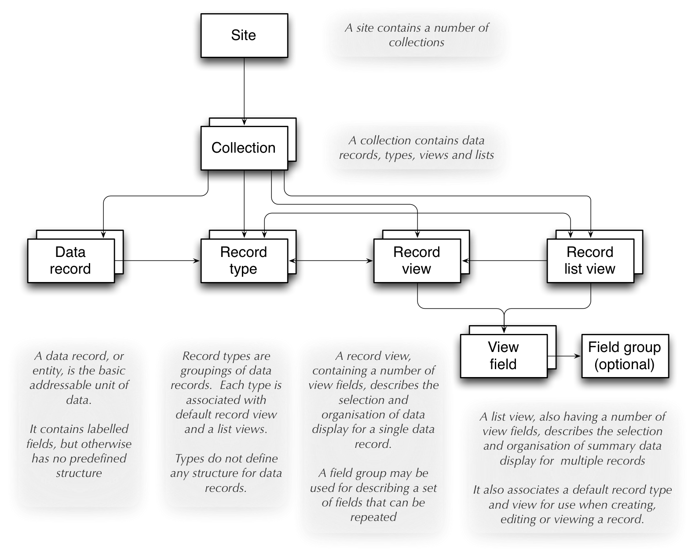
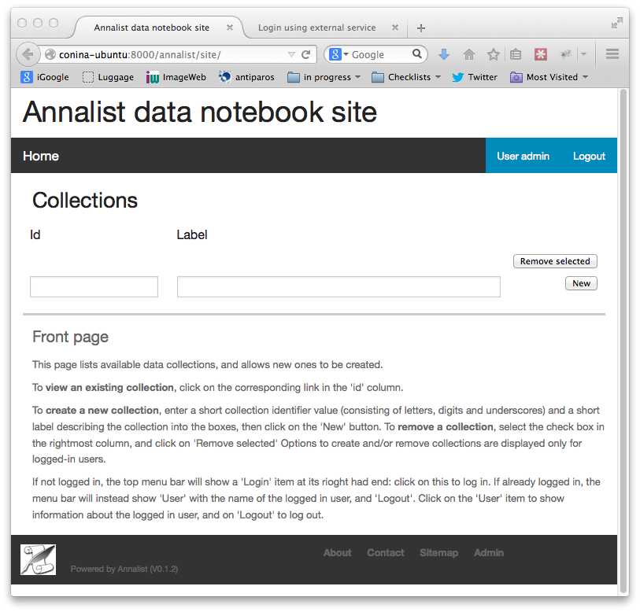
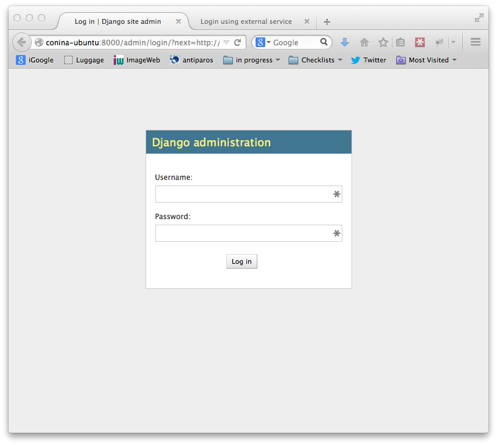
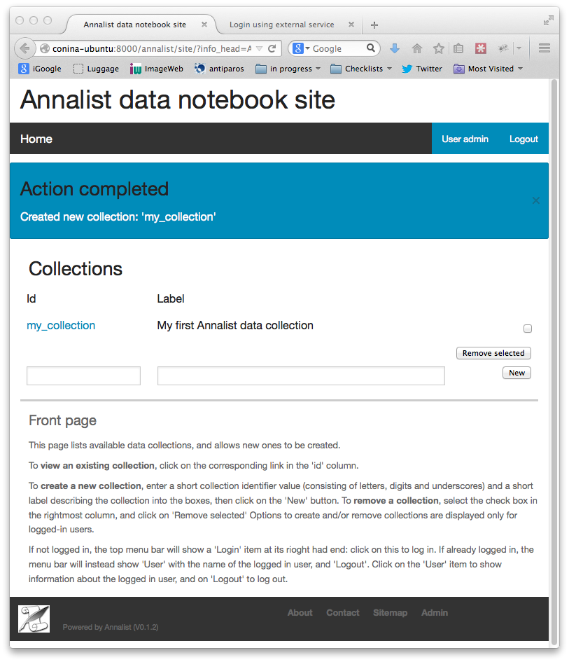

# Guide to using Annalist

# Concepts

## Site

A site corresponds to an Annalist installation.  It may contain any number of data collections.

## Collections

A **collection** is a grouping of data under a single administrative control (i.e. access control is applied at the level of a collection;  there is no fines-grained access control within a collection.)

## Data records

A **data record** is a web-accessible unit of user data.   Each data record has an entity identifier and a type identifier;  the combination of collection identifier, type identifier and entity identifier uniquely identify a data record within a site.  Combined with the site's URI, this invormation allows for any data record to have a unique identity on the World Wide Web, which is fundamental to Annalist's support for linked data.

A data record may have any number of properties; new properties may be added at any time to any data record.  Each property is identified by a URI or CURIE (often referred to as URIs).  There may be multiple values associated with any property URI.  This representation of data records with arbitrary properties is at the heart of Annalist's flexibility, and is based on the RDF and JSON-LD data models.  By not imposing any predefined structure, the content of any data record can be varied as needs dictate.  Presented structure is defined, as needed, by views on a data record (see below).

The data type of a property value is not formally constrained.  Multiple instances of the property may have values with different data types.  In practice, the data type associated with a property is determined by the field type (see below) used in the views though which data is entered and/or displayed, and these will generally present and interpret the property value as a particular data type.  If different data types do appear for a single property URI, the view- and list-fields used should be able to handle them appropriately.

## Record types

**Record types** provide a simple, coarse-grained way of distinguishing different types of record from a user perspective, and associating with different content presentation as appropriate.  Each data record has exactly one data type, which is used directly to help organize the underlying data storage.  The intent is that data types are used to ceate a top-level organization of different kinds of data within a collection.  Finer-grained and cross-cutting type distinctions may be made though properties on each data record.

In keeping with the idea that properties can be added to any data record at any tine, the description of a record type does not include any structural information.  Rather, it includes descriptive information, and association with default view and list presentations (other view and list presentations can be used, but must be explicitly selected).

## Record views

A **record view** describes a selection and organization of properties to be used when displaying a single data record.  As such, a view establishes a presentation of a particular kind of structure on the data.  Different views may present different structures over the same underlying data.  A view is defined with a number of fields (see below).

## List views

A **list view** describes a selection and organization of data records and properties to be used for displaying multiple data records.  They are used to create summary displays from which individual data records may be selected.  A list is defined with a data record selector and a number of fields (see below).

Associated with each collection is a default list view, which is displayed when a collection is initially accessed.

## Fields

Record and list views are build up using **fields**, which associate a data record property URI with a field renderer and a stored data value type.  A field render formats data for presentation (essentially as a fragment of HTML), and interprets user input as a storable data value.

The available field renderers are defined by Annalist, and the range of rendering options is expected to increase as the software is developed.  Currently, there are three main types of renderer:  single-line text (Text), multiline text (TextArea) and enumeration, pwhich presents a selection of identifiers of some other defined type.

## Entities

Data records, types, views, lists, fields and more are all handled internally as **entities**, which are always associated with a data type.  data types, views, lists and fields are associated with the special data types `_typr`, `_view`, `_list` and `_field` respectively.  Using these predefined types, their descriptions can be processed using the same facilities that are used to create, modify and view user data records.

Additional special data types may be added as new features are implemented.  A convention has been adopted that the special data types have type identifiers that beging with an underscore (`'_'`), so user data types and entities should be ctreated with idnetifiers that do not start with an underscore.

Entities are stored as flat files in JSON (JSON-LD) format.

## Site-wide data

A site has been described as consisting of a number of collections containing user-defined entities (data records, data types, views, lists, etc).

There is also provision for site-wide entities, which is used mainly for the predefined Annalist special types (`_type`, '_view`, `_list`, etc., and also for some predefined instances of these), but which can be used for any data.  All site-wide values are available to all collections in a site.  If a collection creates a local entity that is also available as a site-wide entity, the local value takes precedence for that collection. 

Site-wide data is fixed for an installation:  it cannot be created or modified through the Annalist user interface.  Certain operations may appear to modify a site-wide value (e.g. editing a default record view): these cause the site-wide dscription to be copied into the collection and updated there.  Thus, the view `default_view`

# Accessing Annalist

The following instructions assume Annalist service running on host `annalist.example.org`.  If a different host is used, replace `annalist.example.org` with the name or IP address of the host that is running the Annalist server.

1.  Browse to annalist server at `http://annalist.example.org:8000` (replacing `localhost` as needed)

    An empty list of collections should be displayed, along with some help text:

    

2.  Select the **Login** item from the top menu bar:

    

3.  Log in to Annalist using one of the procedures described belo.]

4.  After logged in, click the **Home** link on the to menu bar to return to the front page:

    

    Note that the front page now shows text entry boxes and a button for creating a new collection.

## Log in with OpenID Connect credentials

The intended means of Annalist user authentication is via a third party identity provider (IDP) service:

1.  Enter a local username (which is how Annalist will identify you, independently of any third party authentication account you may use), select an IDP (e.g. 'Google') and click **Login**.

2.  If you are not already logged in to the IDP you will be asked to login via their site.  Then the IDP will ask your permission to disclose basic identifying information (email, first name and last name) to Annalist.  This step is skipped if you have completed these actions previously.

3.  If this is an existing Annalist account, and the email from the IDP matches the Annalist account email, you will be logged in.  If the username given does not match an existing Annalist account, a new account is created with the appropriate details and you are logged in to it.  Being logged in does not necessarily mean you have permissions to access Annalist data;  it simply means that Annalist has an indicator of who you are.

(@@NOTE: Currently, the authorization system is not fully implememted, and all authenticated users have full access to the Annalist data, but that will change before the first non-prototype software release.  See [Annalist issue 11](https://github.com/gklyne/annalist/issues/11))

## Log in with local user credentials

(See below for creating local user credentials)

1.  Select the "Local user credentials: **login**" link at the bottom of the page:

    

2.  Enter a previously created username and password

3.  Click on the **Login** button

## Creating local user credentials

The Annalist software installation includes a step to create an adin user:

    annalist-manager createadminuser

Thye username and password created at this step can be used as local credentials to log in to Annalist as described above.

Having logged in using the admin username and password, the **Admin** link in the page footer can be used to create additional local users via the local administrative interface (which is implemented in the underlying Django web application framework).  When logged in to Annalist using this account, the **Admin** link in the footer of most Annalist pages will allow new user accounts to be created via the Django admin interface.  More documentation about using this admin interface can be found in the [The Django Admin Site](http://www.djangobook.com/en/2.0/chapter06.html), which is Chapter 6 of [The Django Book](http://www.djangobook.com/en/2.0/index.html).

# Creating an Annalist collection

To create a new collection, enter a short name for the collection (consisting of just letters, digits and/or underscorte (`'_'`) characters) and a one-line label or description (which can contain arbitrary characters) into the text boxes presented:

Now click on the 'New' button:

Click on the link in the Id column to view the new collection:

From this screen, you can start to add data to this collection.

# Create and modify data records

@@TODO: flesh out, add screenshots

## Create a data record

Click the **New** button at the foot of any record list page.

## Create a data record initialzed with a copy of an existing record

Select a record list display that includes the record to be copied.

Select the checkbox beside the record to be copied.

Click the **Copy** button at the foot of the record list page.

## Edit an existing data record

Select a record list display that includes the record to be edited.

Select the checkbox beside the record to be edited.

Click the **Edit** button at the foot of the record list page.

## Delete an existing data record

Select a record list display that includes the record to be deleted.

Select the checkbox beside the record to be deleted.

Click the **Delete** button at the foot of the record list page.

A new page will be displayed requesting confirmation that the record should be deleted.  Click on **Confirm** to delete the record, or **Cancel** abort the delete operation to teturn to the record list page.

## Data record editing page

The **New**, **Copy** and **Edit** operations described above present a new page containing fields of the data record being created or edited.

For the most part, new or updated values may be entered into any of the fields.  Changing the record `Id` or `Type` values will cause the record to be renamed; that is, its URL will change to reflect the new values.

Click the **Save** buttonm to save all changes made, or **Cancel** to discard any changes and return to the previous display.

The **Add field** button causes any entered data to be saved, and a record view edit form to be displayed with an additonal field added to the view.  Make any desired changes, then click **Save** to update the view and return to the record data editing view.  Any new field defined is now displayed.

The **Choose view** dropdown box and **Show view** buttons allow an alternative record view to be used to display the current record data.

The **New view**, **New field** and **New type** buttons cause the current data record to be saved, and new a new form to be displayed for entry of details about a new record view, field or data type respectively.  When new details entered are saved, or cancelled, the current page is redisplayed, possible any new values entered.  These views are intended to allow new structure to be added to a collection as needs may be recognized while data is being entered.

## Record list page

The **New**, **Copy**, *Edit** and **Delete** buttons allow records to be created, edited or deleted as described above.

The **List view** dropdown allows an alternative list view to be selected from those available, and the **View** button causes the selected list view to replace the current display.

The **Search** field can be used to enter a search term to narrow down the list of data records displayed.  Click ther **View** button to show those data ecords matching the search term entered.  If the search term is blank, all data records correspnding to the selected list view are displayed.

The **Set default** button causes the currently displayed list to be made the default display for the current collection.

Finally, the **Customize** button displays a "Customize cillection" page, which has options to create, copy, edit and delete data record types, record views, and list views.

## Custmize collection page

@@TODO: flesh out

Has 3 areas for "Record types", "List views" and "Record views".

Each lists currently defined values, and has buttons **New**, **Copy**, **Edit** and **Delete**.

The **Close** button returns to the previopusly displayed list view (which may change if the list definition) has been changed.

