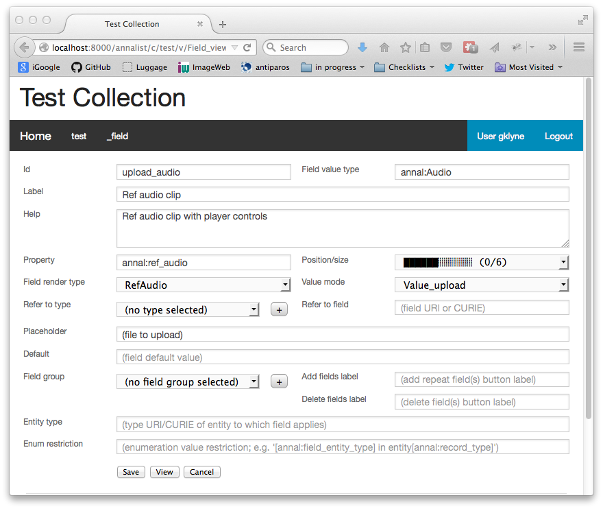

= View fields in Annalist
Graham Klyne
v0.1.16, 2015-08-04
:toc: macro
:toc-title:

Annalist uses _views_ to define user-definable presentation of data for display and editing.

These views essentially consist of a list of _fields_ to be displayed from the presented entity.  Each field is defined by a number of parameters (which are themselves managed using an Annalist view, viz. `Field_view`).

This page describes the field definition parameters and in particular introduces the available field rendering types.  It also discusses additional considerations for repeated fields, and fields that reference uploaded files or imported web resources.

Note: much of field description processing is handled by modules `annalist.views.form_utils.fielddescription` and `annalist.views.fields.bound_field`, coordinated by `annalist.views.entityedit` and `annalist.views.entitylist`.

*Table of Contents*

toc::[]

== Field description values

A field description is entered through a form that looks like this:

[[Field_edit_form]]

The fields of this form are described in the following sections (parenthesized values are field identifiers).

=== Id (`Field_id`)

This is a name that is used to distinguish a field definition from all available fields.  Consists of up to 32 letters, digits and/or underscore characters.  Case sensistive, but on some systems it is not possible to have different fields whose identifiers differ in just upper- and lower-case letters.

////
=== Field input name (`Field_name`)

Used internally to generate the name of a field in an HTML form view, which is used in turn to identify the corresponding value returned when the form is submitted.  Defaults to the value of `Field_id`.

(Currently not supported in field editing view, but can be set in stored field description records. @@)
////

=== Field value type (`Field_type`)

Type (as a URI or CURIE) of underlying data that is stored in a field.  

This field is provided as an additional information and as a hint to the field renderer;  in most cases, the value is not actually used, so it is possible that values used are not always assigned consistently.

See also the section <<Field value types>> below.

=== Label (`Field_label`)

A short textual label for the field.  The label is displayed as part of the form in which the field appears.

=== Help (`Field_comment`)

A longer textual description of the field.

Currently this is displated as part of the field description, but future renderer implementations may use this for pop-up help text when editing and/ort viewing data using a form.

When editing, use http://daringfireball.net/projects/markdown/[Markdown] conventions to indicate how the text whould be presented when viewed.

(@@TODO: use the description for pop-up help text in the form.)

=== Property (`Field_property`)

A http://www.w3.org/TR/curie/[CURIE] or https://tools.ietf.org/html/rfc3986[URI] that is used to relate the field value to the containing entity.  The supplied string is used as a key value in the stored JSON.  The use of CURIE or URI formats for this key allows Annalist data to be interpreted as JSON-LD, hence as http://linkeddata.org[linked data].

A default property CURIE or URI can be specified as part of the field description, and overridden when the field is included in a particular view.

(@@TODO: not yet implemented is management of prefix URIs and JSON-LD contexts required to fully support use as linked data)

=== Position/size (`Field_placement`)

Used to specifying the position of of a field in a form display, specified in terms of width and horizontal placement on a responsive display grid 1,2.

Internally, the placement is stored as a specially formatted string.  It is presented for viewing as a rough visual indication of the filed placement, and for editing as a dropdown list of options.

Default placement can be specified as part of the field description, and overridden when the field is included in a particular view.

Normal field placement uses the indicated field width on larger displays, and uses the full widthj of smaller displays.

Also offered are "column" placement values that use the indicated width on display of all sizes - these should be used with care as values can easily overflow the available field widthj on smaller displays.  They are intended to be used with list displays where the columns present a one-line summary of the record contents.

@@NOTE As of release 0.1.18, the current implementation does not fully implement field positioning:  the width provided is used, but the position is ignored, so if there are gaps in a row the next field may appear in a location other than that requested by the placement.  This should be adressed in a future release.

=== Field renderer type (`Field_render`)

Identifier that indicates how the field value is rendered, indicating one of a number of available built-in field renderers.  The stored value is the identrifier string (slug).  It is presented for editing as a drop-down list of available values and for viewing as a hyperlink to the term description.

See also the section "Field render types" below.

=== Field value mode (`Field_value_mode`)

Mode of access to displayed field data; one of: `Value_direct`, `Value_import`, `Value_upload`, `Value_entity` or `Value_field`.  If in doubt, use `Value_direct`.

* Direct display and editing (`Value_direct`): most display fields simply display a field value directly from the presented entity record, or allow that field value to be entered or edited directly.  But there are some situations which vary this behaviour:

* Imported URI (`Value_import`): the displayed value is an imported resource (e.g. an image).  When editing, atext box is displayed into which a URI can be entered, and a button to trigger the resource import.  The resource is stored as an attachment to the entity, and a description is stored in the entity record.

* Uploaded file: the displayed value is an uploaded file (e.g. an image).  When editing, a file briwser control is provided for the user to select a file to be uploaded.  The file is stored as an attachment to the entity, and a description is stored in the entity record.

* Reference to linked entity field (`Value_field`): the displayed value is a single field from a linked entity.  When editing, a selection is made from a dropdown list of available entities.

* Reference to linked entity (`Value_entity`), used with `RefMultifield` render type: the displayed value is one or more fields selected from a linked entity (e.g., a reference to an entity record containing an image and description can be displayed as image and descripotion fields from that record.)  When editing, a selection is made from a dropdown list of available entities.

=== Refer to type (`Field_typeref`)

Used with render types `Enum`, `Enum_optional` and `Enum_choice` (and also `Type`, `List`, `View`, `Field` which are sumsumed by the `Enum*` render types).

When specified, this field value is an internal type identifier.  The field is taken to be a reference to an entity of the given type, and presented for editing as a drop-down list of available values.  For viewing, the field is presented as a hyperlink to a description of the corresponding type.

=== Refer to field (`Field_fieldref`)

When a field refers to some target entity, this may indicate a property CURIE or URI for a field of that entity that is used for view rendering.

See section "Resource references, imports and file uploads" for more details.

=== Placeholder (`Field_placeholder`)

A string that is presented to describe the expected field content when the field content is empty

=== Default (`Field_default`)

A default value for the field if none is specified.

=== Field group (`Field_groupref`)

Field group reference used by `RepeatGroup`, `RepeatGroupRow` and `RefMultifield` renderers.  Otherwise, it is ignored.

The value is a reference to a separately defined field group, which itself contains a list of field description references.  The group itself defines a group of fields that are included in a view.

The field value is presented for editing as a drop-down list, and for viewing as a hyperlink to the selected field group.

See also the section "Repeated field groups"

=== Add fields label (`Field_repeat_label_add`)

Button label used by `RepeatGroup` and `RepeatGroupRow` renderers.  Otherwise, it is ignored.

See also the section "Repeated field groups"

=== Delete fields label (`Field_repeat_label_delete`)

Button label used by `RepeatGroup` and `RepeatGroupRow` renderers.  Otherwise, it is ignored.

See also the section "Repeated field groups"

=== Entity type (`Field_entity_type`)

Type (URI or CURIE) of entity to which field applies.

This is used to restrict the fields that are offered when editing a view or list description (see also field `View_target_type` used in view descriptions).  If in doubt, leave this field blank (and the field will be offered as an option jn views of any record type).

Many, or even most, field descriptions are specific to a particular entity type, but some are generic.  If this value is not specified, the corresponding field is offered as an option for any entity type, but if given then it is offered only when editing a view or list for the specified type.

Note that field groups are an implicit type, named by the field `annal:Record_type` in the group description (similar to the same field in a View description which names the type to which a view is intended to apply).  Sometimes, this is the same URI as the record type/view with which the group is used, but may also be a disticnt URI.  Using a distinct URIs means that field desriptions that appear only as part of a group can be presented for that group.  An example of this is the `View_field_sel`, `View_field_property` and `View_field_placement` fields that may appear in a `Vioew_field_group` which is used in a `View_view` view description; the type URI associated with the `View_field_group` is `annal:View_field`.

Note that the `Field_entity_type` has no direct effect on the underlying data: it is used simply to control options that are presented through the user interface used when defining views.

If in doubt, leave this field blank, or specify the same type URI as the view with which it will be used (and use the same type URI in any group description).

=== Entity restriction (`Field_restrict`)

Selection filter to restrict enumerated entity values that are candidate field values.

This is provided mainly for internal use to implement the `Field_entity_type` feature.  If in doubt, leave this field blank.

The field value is a string expression that is used to filter candidates that are presented as members of an enumerated value.  The selection filter syntax is defined by module `annalist.models.entityfimnder`, and is used for enumerated value fields and also for generating entity list displays (cf. `List_entity_selector` field used in `List_view`).

== Repeated field groups

Some entities contain fields or groups of fields that may be repeated an arbitrary number of times.  This repetition is described within a view description as a single field that consists of a list of values rendered using a `RepeatGroup` and `RepeatGroupRow` renderer.

Repeated field groups can also be used for optional groups of fields, by virtue of allowing zero or one repetitions.

A repeated field description contains three particular elements not used by other field descriptions:

1. a reference to a field group
2. a label for a button used to create a new repetition
3. a label for a button used to delete a repeated value (or values)

The field group is a separately defined entity that mainly consists of a list of field references, along with optional property URI and placement information which, if present, overrides the default values from the individual field descriptions.

Thus, to create a repeated field in a view, the following steps must be performed:

* Create descriptions for the individual fields that are to be repeated
* Create a field group description collecting the fields to be repeated
* Create a repeat group field with render type `RepeatGroup` or `RepeatGroupRow`, referencing the field group, and defining labels for the add/remoive buttons.
* Add the repeat group field to the view in which the repeated fields are to appear.

(@@TODO: provide a simplified interface for doing the above through a single form)

When displayed in editing mode, each value in the repeated structure has an associated checkbox, and buttons are added for the following options:

* to create a new instance of the repeated structure; this is labelled with a value from the field description.
* to remove one or more selected instances (i.e. those selected via their checkboxes)
* to move one or more selected instances up by one place in the repeat list
* to move one or more selected instances down by one place in the repeat list

== Resource references, imports and file uploads

Annalist primarily deals with collections of data that are stored as JSON (or JSON-LD) text files, which can in turn reference other resources, including images and other non-textual media, that are accessible on the Web.  But sometimes it is useful to import such resources so that they become part of a published Annalist collection, and to reference such resources.

Annalist deals with such circumstances by allowing arbitrary files and resources to be "attached" to an Annalist entity, via file upload (render type `FileUpload`) and web import (render type `URIImport`) fields. These attachments are described and referenced within the JSON representation of an entity record, and stored alongside the JSON as files of the appropriate type.  This approach allows Annalist to preserve information about the attachments such as the content type and provenance information.  Further, Annalist fields in one entity can reference fields in another entity, and for fields using resource renderers (such as `RefImage` amnd `RefAudio`), a reference to such a field is treated as a reference to the attached resource.

Web resources can be imported as attachements to an entity by creating a field with render type `URIImport`.  This is rendered for editing as a text input field for the resource URI with an "Import" button alongside, and for viewing as a hyperlink that links to the imported resource attached to the entity.

Files can be uploaded as attachements to an entity by creating a field with render type `FileUpload`.  This is rendered for editing as an HTML file browser input, and for viewing as a hyperlink that links to the imported file attached to the entity.

For referencing resources, there are several options, provided through renderers like <<Link to external resource (`URILink`),`URILink`>>, <<Reference to image resource (`RefImage`),`RefImage`>> and <<Reference to audio resource (`RefAudio`),`RefAudio`>>:

. Direct reference to a resource (usually an external resource)
. Reference to an imported attachment in the current entity
. Reference to an uploaded attachment in the current entity
. Reference to an imported or uploaded attachment in a designated entity

These different cases are invoked using different values of <<Field value mode (`Field_value_mode`)>> as follows.
1

=== Direct reference to a resource

This option is mainly used for referencing an external resource; e.g. an image stored on Flickr.

The value of <<Field value mode (`Field_value_mode`)>> is specified as `Value_direct`, <<Field value type (`Field_type`)>> describes the target value (e.g. `annal:Identifier` or `annal:Image`), and fields <<Refer to type (`Field_typeref`)>> and <<Refer to field (`Field_fieldref`)>> are unspecified or blank.

The value of <<Field renderer type (`Field_render`)>> is specified as appropriate to the resource referenced (e.g. <<Link to external resource (`URILink`),`URILink`>>, <<Reference to image resource (`RefImage`),`RefImage`>> or <<Reference to audio resource (`RefAudio`),`RefAudio`>>).

In this case the field value is used directly as the resource URI, and for editing is presented as a text input box.

=== Reference to an imported attachment in the current entity

The value of <<Field value mode (`Field_value_mode`)>> is specified as `Value_import`, <<Field value type (`Field_type`)>> describes the target value (e.g. `annal:Image` or `annal:Audio`), and fields <<Refer to type (`Field_typeref`)>> and <<Refer to field (`Field_fieldref`)>> are unspecified or blank.

In this case the field value describes an attachment to the current entity, and for editing is presented as render type <<Web resource import (`URIImport`)>>.

=== Reference to an uploaded attachment in the current entity

The value of <<Field value mode (`Field_value_mode`)>> is specified as `Value_upload`, <<Field value type (`Field_type`)>> describes the target value (e.g. `annal:Image` or `annal:Audio`), and and fields <<Refer to type (`Field_typeref`)>> and <<Refer to field (`Field_fieldref`)>> are unspecified or blank.

In this case the field value describes an attachment to the current entity, and for editing is presented as render type <<File upload (`FileUpload`)>>.

=== Reference to an imported or uploaded attachment in a designated entity

The value of <<Field value mode (`Field_value_mode`)>> is specified as `Value_field`, <<Refer to type (`Field_typeref`)>> is the target entity type, and <<Refer to field (`Field_fieldref`)>> is the target field property CURIE or URI for the attachment; this is the same as the <<Property (`Field_property`)>> value in the target field description.

The stored field value is an identifier for a selected target record, and is presented for editing as a drop-down list of entity identifiers.  When viewing, it is presented according to the target field description (e.g. `RefImage` or `Markdown`)

(I have found to date that the multi-field reference tends to be more useful than this form of field reference, and this option may be considered for deprecation in a future release.  The same effect can be obtained using a `RefMultifield` renderer with a field group containing just one field.)

=== Multi-field references

Multi-field references are used when several fields from a designated entity are to be displayed.  For example, if a referenced entity contains an image and a description, a single reference to that entity can display both.  This can be useful, for example, if uploaded images are stored separately with their descriptions.

The value of <<Field value mode (`Field_value_mode`)>> is specified as `Value_entity`, <<Refer to type (`Field_typeref`)>> is the target entity type, <<Field renderer type (`Field_render`)>> is `RefMultifield` , <<Refer to type (`Field_typeref`)>> is the target entity type, and field <<Refer to field (`Field_fieldref`)>> is unspecified or blank.

Further, <<Field group (`Field_groupref`)>> indicates a field group that lists the fields to be displayed from the target record.

When editing an entity, the field is displayed as a single drop-down list from which a target entity can be selected.  When viewing the entity, the fields referenced by the field group are displayed from the selected entity.

== Field render types

Annalist provides a number of built-in field rendering functions for dealing with different types and uses of field data.

Each renderer deals with two main functions:

1. conversion between stored data to a textual value that can be used as a input value in an HTML form, and
2. generation of HTML fragments for presentation in a web page.  Different forms of presentation are provided for viewing and editing.

Some of the values listed below were created to handle earlier stages of development, are now redundant, and in due course their use should be replaced by the more generic renderers indicated.

(The definitive list of render types is in `annalist/sitedata/enums/Enum_render_type`.  Renderer selection is handled through module `annalist.views.fields.rener_utils`.)

=== Single line text (`Text`)

A simple single-line text value, presented for editing as an HTML input field, and for viewing as a simple text element.

=== Multiline text (`Textarea`)

A multi-line text value, presented for editing as an HTML "textarea" field, and for viewing as a simple flowed text element.

=== MArkdown rich text (`Markdown`)

Multiline rich text.  Stored and presented for editing as plain text text, and for viewing as text formatted according to http://daringfireball.net/projects/markdown/[Markdown] conventions.

=== Select entity `Enum`

Presents a value of a designated type (see field <<Refer to type (`Field_typeref`)>>) as a dropdown list for edting, or as a hyperlink for viewing.

Requires some existing value to be selected and picks an arbitrary value for a default.

=== Select or create entity `Enum_choice`

Presents a value of a designated type (see field <<Refer to type (`Field_typeref`)>>) as a dropdown list for edting, or as a hyperlink for viewing.  Also provides a "+" button which can be used to create a new value of the designated type.

The value may be left unselected, in which case the stored value is blank.

=== Optional entity selection `Enum_optional`

Presents a value of a designated type (see field <<Refer to type (`Field_typeref`)>>) as a dropdown list for edting, or as a hyperlink for viewing.

The value may be left unselected, in which case the stored value is blank.

=== CURIE or URI (`Identifier`)

A http://www.w3.org/TR/curie/[CURIE] or https://tools.ietf.org/html/rfc3986[URI].  Preesented for editing as a text box, and for viewing as a simple text element.

=== Field position and size (`Placement`)

A special-case field renderer used for presenting placement of a field on a form.

=== Reference to image resource (`RefImage`)

A reference to an image value, presented for viewing as the referenced image.  See also section <<Resource references, imports and file uploads>>.

=== Reference to audio resource (`RefAudio`)

A reference to an audio resourcxe, presented for viewing as a media player widget.  See also section "Resource references, imports and file uploads".

=== Boolean as checkbox (`CheckBox`)

Presents a Boolean value as a checkbox.

=== Entity identifier (`EntityId`)

Presents an entity identitier as a simple input field for editing, or as a hyperlink for viewing.

=== Entity type identifier (`EntityTypeId`)

Presents the entity type identifier a simple input field for editing, or as a hyperlink for viewing.

=== Repeated field group (`RepeatGroup`)

A special case renderer used for describing repeated fields in a view description.  The stored value is a list of JSON objects, each of which is rendered using the field group reference from the field description (see section "Repeated field groups" and field `Field_groupref`).  Fields within each group are flowed vertically down the view with labels to the left.

Viewed as a repeated group of fields with a common heading.

When editing, additional controls are provided to add a new value or delete existing values from the repeat group.  Also, for moving selected entries up or down within the list.

(Hint: to move a single entry up by several places, select the entries over which it will be moved and select the button to move them all in the opposite direction.)

A repeat group can also be used for optional values in an entity record.

=== Repeated field group as rows of table `RepeatGroupRow`

Same as `RepeatGroup`, except that field groups are rendered in tabular form with field labels for column headers, and each repeated group as a row of the table.

=== Short identifier string (`Slug`)

A simple text value used as an internal local identifier, or Slug, presented in the same way as the 'Text' renderer.  The text value is expected to consist of up to 32 letters, digits and/or underscore characters, (but this is not currently enforced @@TODO).

=== List of text tokens (`TokenSet`)

a list of simple text values, presented for editing as an HTML input field, and for viewing as a simple text element.  Presented values are space-separated.  Currently there is no mechanism to escape spaces within individual text values (@@TODO).

=== Link to external resource (`URILink`)

A URI presented for viewing as a Hyperlink, used to create fields that reference externally stored resources.  See also section "Resource references, imports and file uploads".

=== File upload (`FileUpload`)

upload file as resource attached to entity.  Stored as a complex structure with filename, resource reference, content type, etc.;  presented for editing as an HTML file upload input element, and for viewing as a hyperlink.  See section "Resource references, imports and file uploads"

Functionality superseded by value mode `Value_upload` used with render type `URILink` (@@CHECK)

=== Web resource import (`URIImport`)

Import a web resource as an attachment to an entity.  Stored as a complex structure with resource URI, local resource reference, content type, etc.;  presented for editing as a text input field and an "Import" button, and for viewing as a hyperlink.  See section "Resource references, imports and file uploads"

Functionality superseded by value mode `Value_import` used with render type `URILink` (@@CHECK)

=== `Type` (to be deprecated)

Identifies an entity type description; subsumed by `Enum`, `Enum_choice` and `Enum_optional`.

=== `View` (to be deprecated)

Identifies a view description; subsumed by subsumed by `Enum`, `Enum_choice` and `Enum_optional`.

=== `List` (to be deprecated)

Identifies a list description; subsumed by subsumed by `Enum`, `Enum_choice` and `Enum_optional`.

=== `Field` (to be deprecated)

Identifies a field description; subsumed by subsumed by `Enum`, `Enum_choice` and `Enum_optional`.

== Field value types

Field value types are identified by URIs or CURIEs that are used to identify some value type.

Built-in values include:

* `annal:Text` - single-line text
* `annal:Longtext` - multi-line plain text
* `annal:Richtext` - multi-line rich text entered, edited and stored using Markdown formatting conventions
* `annal:Slug` - short text sring used as an internal identifier (consists of up to 32 letters, digits and/or underscore characters)
* `annal:Identifier` - text value containing a http://www.w3.org/TR/curie/[CURIE] or https://tools.ietf.org/html/rfc3986[URI]
* `annal:URI` - text value containing a https://tools.ietf.org/html/rfc3986[URI]
* `annal:Placement` - text value indicating the placement of a field in a display, and presented as a rough visial indication of the field placement (see module `annalist.views.fields.render_placement`)
* `annal:Field_group` - value of a field that is itself a reference to a field group (which is itself a list of fields); used for repeated-value fields.
* `annal:Type` - mainly internal use for reference to an Annalist entity type; the stored value is an `annal:Slug` text value, presented as a drop-down list or a hyperlink
* `annal:View` - mainly internal use for reference to an Annalist view description; the stored value is an `annal:Slug` text value, presented as a drop-down list or a hyperlink
* `annal:List` - mainly internal use for reference to an Annalist list description; the stored value is an `annal:Slug` text value, presented as a drop-down list or a hyperlink
* `annal:User` - reference to an Annalist user; the stored value is an `annal:Slug` text value
* `annal:List_type` - type of list display: "List" or "Grid"
* `annal:TokenSet` - list of string token values (e.g. used for user permissions list); stored as a JSON list, presented as a space-separated list of tokens
* `annal:Boolean` - stored as JSON `true` or `talse`, typically presented as a checkbox.

== References

1. Foundation responsive web framwork. http://foundation.zurb.com

2. Foundation grid. http://foundation.zurb.com/docs/components/grid.html

3. CURIE (Compact URI). http://www.w3.org/TR/curie/

4. URI. https://tools.ietf.org/html/rfc3986

