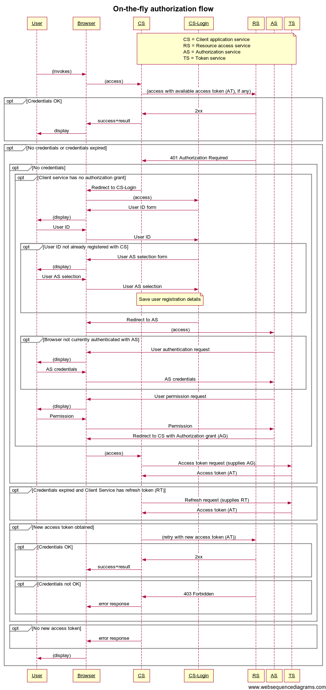
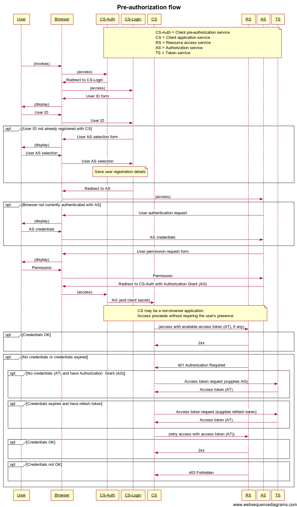
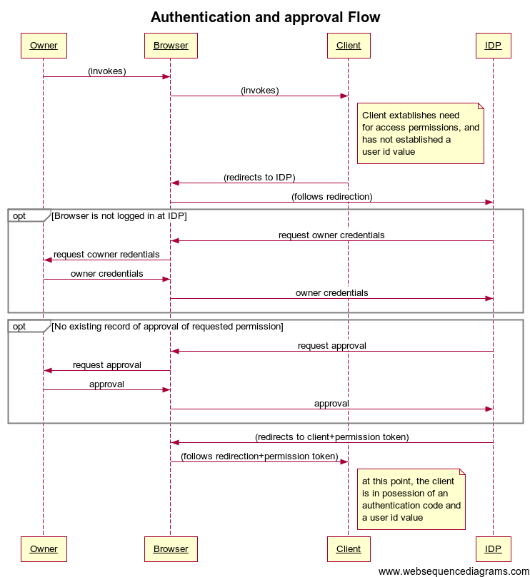

# On-the-fly authorization flow

This sequence applies when access authorization is requested on-the-fly as a resource is accessed.  As such, it works only when the user is accessing the resource via a browser.  This is built on a standard OAuth2 flow combining authentication with authorization.

Sequence diagram definition - use with https://www.websequencediagrams.com/

    title On-the-fly authorization flow

    participant User
    participant Browser
    participant CS
    participant CS-Login
    participant RS
    participant AS
    participant TS

    note over CS, RS, AS, TS
      CS = Client application service
      RS = Resource access service
      AS = Authorization service
      TS = Token service
    end note

    User->Browser: (invokes)
    Browser->CS: (access)

    CS->RS: (access with available access token (AT), if any)
    opt Credentials OK
      RS->CS: 2xx
      CS->Browser: success+result
      Browser->User: display
    end

    opt No credentials or credentials expired
      RS->CS: 401 Authorization Required

      opt No credentials
        opt Client service has no authorization grant
          CS->Browser: Redirect to CS-Login
          Browser->CS-Login: (access)
          CS-Login->Browser: User ID form
          Browser->User: (display)
          User->Browser: User ID
          Browser->CS-Login: User ID
          opt User ID not already registered with CS
            CS-Login->Browser: User AS selection form
            Browser->User: (display)
            User->Browser: User AS selection
            Browser->CS-Login: User AS selection
            note over CS, CS-Login
              Save user registration details
            end note
          end
          CS-Login->Browser: Redirect to AS
          Browser->AS: (access)
          opt Browser not currently authenticated with AS
            AS->Browser: User authentication request
            Browser->User: (display)
            User->Browser: AS credentials
            Browser->AS: AS credentials
          end
          AS->Browser: User permission request
          Browser->User: (display)
          User->Browser: Permission
          Browser->AS: Permission
          AS->Browser: Redirect to CS with Authorization grant (AG)
        end
        Browser->CS: (access)
        CS->TS: Access token request (supplies AG)
        TS->CS: Access token (AT)
      end

      opt Credentials expired and Client Service has refresh token (RT)
        CS->TS: Refresh request (supplies RT)
        TS->CS: Access token (AT)
      end

      opt New access token obtained
        CS->RS: (retry with new access token (AT))
        opt Credentials OK
          RS->CS: 2xx
          CS->Browser: success+result
        end
        opt Credentials not OK
          RS->CS: 403 Forbidden
          CS->Browser: error response
        end
      end

      opt No new access token
        CS->Browser: error response
      end

    Browser->User: (display)
    end

# Pre-authorization flow

This sequence applies when access authorization is established in advance of access to a resource.  The first part of the flow works only when the user is accessing the service using a browser.  The second part maty be cobnducted wityhout the user present.  This is built on a standard OAuth2 flow combining authentication with authorization.

Sequence diagram definition - use with https://www.websequencediagrams.com/

    title Pre-authorization flow

    participant User
    participant Browser
    participant CS-Auth
    participant CS-Login
    participant CS
    participant RS
    participant AS
    participant TS

    note over CS-Auth, CS, RS, AS, TS
      CS-Auth = Client pre-authorization service
      CS = Client application service
      RS = Resource access service
      AS = Authorization service
      TS = Token service
    end note

    User->Browser: (invokes)
    Browser->CS-Auth: (access)

    CS-Auth->Browser: Redirect to CS-Login
    Browser->CS-Login: (access)
    CS-Login->Browser: User ID form
    Browser->User: (display)
    User->Browser: User ID
    Browser->CS-Login: User ID
    opt User ID not already registered with CS
      CS-Login->Browser: User AS selection form
      Browser->User: (display)
      User->Browser: User AS selection
      Browser->CS-Login: User AS selection
      note over CS-Auth, CS-Login
        Save user registration details
      end note
    end
    CS-Login->Browser: Redirect to AS
    Browser->AS: (access)
    opt Browser not currently authenticated with AS
      AS->Browser: User authentication request
      Browser->User: (display)
      User->Browser: AS credentials
      Browser->AS: AS credentials
    end
    AS->Browser: User permission request form
    Browser->User: (display)
    User->Browser: Permission
    Browser->AS: Permission
    AS->Browser: Redirect to CS-Auth with Authorization Grant (AG)
    Browser->CS-Auth: (access)
    CS-Auth->CS: AG (and client secret)

    note over CS-Login, CS-Auth, CS, RS, AS
      CS may be a non-browser application.
      Access proceeds without requiring the user's presence
    end note

    CS->RS: (access with available access token (AT), if any)
    opt Credentials OK
      RS->CS: 2xx
    end

    opt No credentials or credentials expired
      RS->CS: 401 Authorization Required

      opt No credentials (AT) and have Authorization  Grant (AG)
        CS->TS: Access token request (supplies AG)
        TS->CS: Access token (AT)
      end

      opt Credentials expired and have refesh token
        CS->TS: Access token request (supplies refresh token)
        TS->CS: Access token (AT)
      end

      CS->RS: (retry access with access token (AT))

      opt Credentials OK
        RS->CS: 2xx
      end

      opt Credentials not OK
        RS->CS: 403 Forbidden
      end

    end

----

# Approval flow

@@TODO: review or remove?

This flow is activated when the client needs to establish the identity and approval of a user for obtaining subsequent authorization tokens.  The identity determination uses OpenID connect mechanisms, but does not result in grant of any specific permissions as these are handled separately by the authorization flow.

The approval request from browser to IDP includes a state value (nonce) provided by the client application, which is returned along with the approval code and should be checked when the approval code is returned.  This is a protection against cross-site request forgery (CSRF) attacks, in which another application tries to exploit a trust relationship between the browser and service.  The state value ensures that the browser request was indeed intiated by the client application.

@@TODO figure how the client state and params get encoded. (It looks as if it should be in the JSON that is POSTED to the auth service, but playground seems to not include the state param.  I may need some actual code to investigate.)  It seems that state is optional with OpenId Connect "Typically, Cross-Site Request Forgery (CSRF, XSRF) mitigation is done by cryptographically binding the value of this [state] parameter with the browser cookie.".

Sequence diagram definition - use with https://www.websequencediagrams.com/

    title Approval Flow
    
    User->Browser: (invokes)
    Browser->Client: (invokes)
    note right of Client:
      Client extablishes need
      for access permissions, and
      has not established a
      user id value
    end note
    
    Client->Browser: ("redirects" to IDP)
    Browser->IDP: (follows "redirection")
    note right of Client:
      This "redirection" may (mustbe?) be 
      by means of a form submission that
      includes the required parameters...?
    end note

    opt Browser is not logged in at IDP
        IDP->Browser: request user credentials
        Browser->User: request user redentials
        User->Browser: user credentials
        Browser->IDP: user credentials
    end
    opt No existing record of approval of requested scope
        IDP->Browser: request approval
        Browser->User: request approval
        User->Browser: approval
        Browser->IDP: approval
    end
    IDP->Browser: (redirects to client+approval token)
    Browser->Client: (follows redirection+approval token)
    
    note right of Client:
      at this point, the client
      is in posession of an 
      authentication code and 
      a user id value
    end note

@@TODO: approval request to incude roles for which approval is required?  I.e. "scope" in OAuth2 flow.

# Authorization flow

@@TODO Review or remove

This flow is activated when the client needs to obtain specific access 
permissions to a resource.  Unlike standard OAuth2 flows, this phase is 
separated from the authentication flow, so the access permissions may be
managed separately from the authentication and approval;  also, this 
phase does not depend on the user being present at a browser to give
approval.

The client may the same or a different program to that which obtained 
the authentication token, in which case the authentication code may be 
passed by some unspecified means.

@@TODO: check that client id aspects still work here.

    title Authorization flow

    User->Browser: (invokes)
    Browser->Client: (invokes)
    note right of Client:
      Client has established
      identity of user, and
      needs grant of authority
      to access resource
    end note

    Client->Authorization svc: request permission (authentication code+client id+perms req)
    Authorization svc->Client: authorization code

    note right of Client:
      at this point, the client
      is in posession of an 
      authorization code and
      possibly a refresh code

@@TODO: revisit UMA and see if UMA elements can be repurposed to fit the requirements.

# Resource access flow

This flow should be the same as the corresponding phase of the OAuth2 flows.

@@TODO: flesh this out to include details of refresh, where needed.

    title Resource access flow

    User->Browser: (invokes)
    Browser->Client: (invokes)
    note right of Client:
      Client needs to access resource,
      and is in possession of an
      authorization code.
    end note

    Client->Authorization svc: request access (authorization code)
    Authorization svc->Client: access token

    note right of Client:
      at this point, the client
      is in posession of an 
      access token
    end note

    Client->Resource svc: request + access token
    Resource svc->Client: (data or response)
